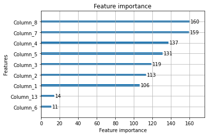
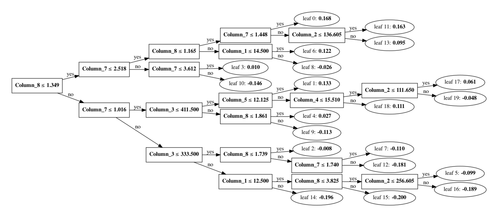
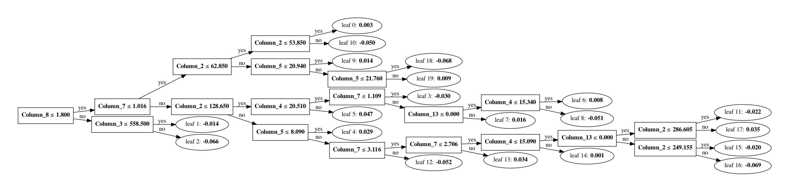

# Flight recommendation: part II
## 1. Prepare data: Training set and testing set

Raw input data sample in csv / libsvm


```python
# raw input in csv format; with header
!head -n5 'data/flight_test.csv'
```

    booked,qid,solutionID,fare,outJourneyTime,outDeptTime,outArrTime,outNumStops,fare_norm,outJourneyTime_norm,outCabinClass_E,outCabinClass_F,outCabinClass_W,outPaxTypes_GVT,outPaxTypes_JWZ
    0,1293,1,138.1,86,8.32,9.75,0,1.0,1.0118,1,0,0,0,1
    0,1293,2,138.1,86,10.07,11.5,0,1.0,1.0118,1,0,0,0,1
    0,1293,3,138.1,85,12.4,13.82,0,1.0,1.0,1,0,0,0,1
    0,1293,4,141.1,264,6.78,11.18,1,1.0217,3.1059,1,0,0,0,1


```python
# preprocessed input in libsvm format; without header
!head -n5 'data/flight.test'
```

    0 1:1 2:138.1 3:86 4:8.32 5:9.75 6:0 7:1.0 8:1.0118 9:1 10:0 11:0 12:0 13:1
    0 1:2 2:138.1 3:86 4:10.07 5:11.5 6:0 7:1.0 8:1.0118 9:1 10:0 11:0 12:0 13:1
    0 1:3 2:138.1 3:85 4:12.4 5:13.82 6:0 7:1.0 8:1.0 9:1 10:0 11:0 12:0 13:1
    0 1:4 2:141.1 3:264 4:6.78 5:11.18 6:1 7:1.0217 8:3.1059 9:1 10:0 11:0 12:0 13:1
    0 1:5 2:141.1 3:291 4:17.37 5:22.22 6:1 7:1.0217 8:3.4235 9:1 10:0 11:0 12:0 13:1


```python
import lightgbm as lgb

# Note: convert the original raw data into a pure libsvm format.
# refer to: https://github.com/guolinke/boosting_tree_benchmarks/tree/master/data
infile_train = 'data/flight.train'
infile_valid = 'data/flight.test'

train_data = lgb.Dataset(infile_train)
valid_data = lgb.Dataset(infile_valid)

# Set group info.
# We can igonre the step if *.query files exist with input files in the same dir.
train_group_size = [l.strip("\n") for l in open(infile_train + ".query")]
valid_group_size = [l.strip("\n") for l in open(infile_valid + ".query")]
train_data.set_group(train_group_size)
valid_data.set_group(valid_group_size)

```


    <lightgbm.basic.Dataset at 0x7ff3437d8be0>


## 2. LightGBM model training

Train a GBM model for learn-to-rank task


```python
# refer to the official experiment doc: https://lightgbm.readthedocs.io/en/latest/Experiments.html
# can be further tuned
param = {
    "task": "train",
    "num_leaves": 20,
    "min_data_in_leaf": 1,
    "min_sum_hessian_in_leaf": 20,
    "objective": "lambdarank",
    "metric": "ndcg",
    "ndcg_eval_at": [3, 5, 10, 15],
    "learning_rate": .1,
    "num_threads": 2
}

#res = {}
evals_result = {}  # to record eval results for plotting

print('Starting training...')
# train

gbm = lgb.train(
    param, train_data, 
    valid_sets=[valid_data], valid_names=["valid"],
    num_boost_round=50, evals_result=evals_result, verbose_eval=10)
```

    Starting training...
    [LightGBM] [Info] Loading query boundaries...
    [LightGBM] [Warning] Auto-choosing row-wise multi-threading, the overhead of testing was 0.002421 seconds.
    You can set `force_row_wise=true` to remove the overhead.
    And if memory is not enough, you can set `force_col_wise=true`.
    [LightGBM] [Info] Total Bins 1787
    [LightGBM] [Info] Number of data points in the train set: 95133, number of used features: 12
    [LightGBM] [Info] Loading query boundaries...
    [10]	valid's ndcg@3: 0.56121	valid's ndcg@5: 0.625891	valid's ndcg@10: 0.663506	valid's ndcg@15: 0.674315
    [20]	valid's ndcg@3: 0.566648	valid's ndcg@5: 0.635857	valid's ndcg@10: 0.671142	valid's ndcg@15: 0.679341
    [30]	valid's ndcg@3: 0.568668	valid's ndcg@5: 0.638396	valid's ndcg@10: 0.668378	valid's ndcg@15: 0.677367
    [40]	valid's ndcg@3: 0.56437	valid's ndcg@5: 0.635832	valid's ndcg@10: 0.665833	valid's ndcg@15: 0.674814
    [50]	valid's ndcg@3: 0.554302	valid's ndcg@5: 0.627094	valid's ndcg@10: 0.657354	valid's ndcg@15: 0.666369


Plot the feature importance. Columns 1-13 correspond to feature:
- Column1:    solutionID,
- Column2:    fare,
- Column3:    outJourneyTime,
- Column4:    outDeptTime,
- Column5:    outArrTime,
- Column6:    outNumStops,
- Column7:    fare_norm,
- Column8:    outJourneyTime_norm,
- Column9:    outCabinClass_E,
- Column10:    outCabinClass_F,
- Column11:    outCabinClass_W,
- Column12:    outPaxTypes_GVT,
- Column13:    outPaxTypes_JWZ


```python
import matplotlib.pyplot as plt
print('Plotting feature importances...')
ax = lgb.plot_importance(gbm, max_num_features=10)
plt.show()

```

    Plotting feature importances...


    

    


Save the model as a json file. 

Then we plot structures of 3 trees at index 0, 16, 32 1and 48. We can obtain structure of any tree from the sequence of 50 trees in the GBM.


```python
# Save the model
import json
with open("lightgbm_model.json", "w+") as f:
    json.dump(gbm.dump_model(), f, indent=2)

```


```python
# plot the first and last tree's structure
lgb.plot_tree(gbm, ax=None, tree_index=0, figsize=None, dpi=700)
lgb.plot_tree(gbm, ax=None, tree_index=48, figsize=None, dpi=700)
```


    <AxesSubplot:>


    

    


    

    


## 3. Evaluation metric: NDCG

Normalized Discounted Cumulative Gain (NDCG) is used as the evaluation metrics. More details will be included...


```python
import pandas as pd
pd.DataFrame(evals_result["valid"]).tail()
#pd.DataFrame(evals_result["valid"])
```


<div>
<style scoped>
    .dataframe tbody tr th:only-of-type {
        vertical-align: middle;
    }

    .dataframe tbody tr th {
        vertical-align: top;
    }

    .dataframe thead th {
        text-align: right;
    }
</style>
<table border="1" class="dataframe">
  <thead>
    <tr style="text-align: right;">
      <th></th>
      <th>ndcg@3</th>
      <th>ndcg@5</th>
      <th>ndcg@10</th>
      <th>ndcg@15</th>
    </tr>
  </thead>
  <tbody>
    <tr>
      <th>45</th>
      <td>0.562422</td>
      <td>0.632150</td>
      <td>0.663294</td>
      <td>0.671542</td>
    </tr>
    <tr>
      <th>46</th>
      <td>0.557315</td>
      <td>0.629566</td>
      <td>0.660711</td>
      <td>0.668919</td>
    </tr>
    <tr>
      <th>47</th>
      <td>0.555110</td>
      <td>0.628690</td>
      <td>0.658832</td>
      <td>0.667040</td>
    </tr>
    <tr>
      <th>48</th>
      <td>0.555110</td>
      <td>0.628037</td>
      <td>0.658371</td>
      <td>0.667413</td>
    </tr>
    <tr>
      <th>49</th>
      <td>0.554302</td>
      <td>0.627094</td>
      <td>0.657354</td>
      <td>0.666369</td>
    </tr>
  </tbody>
</table>
</div>


```python
# df_test = pd.read_csv('flight_data/flight.test', delimiter = " ", header=None)
df_test = pd.read_csv('data/flight_test.txt', delimiter = "\t", header=None)

rename_headers = False
# change header names
import csv
if rename_headers:
    with open("data/flight_test.csv", "r") as f:
        reader = csv.reader(f)
        header_names = next(reader)
    df_test.columns = header_names

```


```python
test_pred_logits = gbm.predict('data/flight.test')
test_pred_logits
len(test_pred_logits)

df_test["predicted_logits"] = test_pred_logits # logits for all queries
df_test.head(5)
```


<div>
<style scoped>
    .dataframe tbody tr th:only-of-type {
        vertical-align: middle;
    }

    .dataframe tbody tr th {
        vertical-align: top;
    }

    .dataframe thead th {
        text-align: right;
    }
</style>
<table border="1" class="dataframe">
  <thead>
    <tr style="text-align: right;">
      <th></th>
      <th>0</th>
      <th>1</th>
      <th>2</th>
      <th>3</th>
      <th>4</th>
      <th>5</th>
      <th>6</th>
      <th>7</th>
      <th>8</th>
      <th>9</th>
      <th>10</th>
      <th>11</th>
      <th>12</th>
      <th>13</th>
      <th>14</th>
      <th>predicted_logits</th>
    </tr>
  </thead>
  <tbody>
    <tr>
      <th>0</th>
      <td>0</td>
      <td>qid:1293</td>
      <td>1:1</td>
      <td>2:138.1</td>
      <td>3:86</td>
      <td>4:8.32</td>
      <td>5:9.75</td>
      <td>6:0</td>
      <td>7:1.0</td>
      <td>8:1.0118</td>
      <td>9:1</td>
      <td>10:0</td>
      <td>11:0</td>
      <td>12:0</td>
      <td>13:1</td>
      <td>1.613497</td>
    </tr>
    <tr>
      <th>1</th>
      <td>0</td>
      <td>qid:1293</td>
      <td>1:2</td>
      <td>2:138.1</td>
      <td>3:86</td>
      <td>4:10.07</td>
      <td>5:11.5</td>
      <td>6:0</td>
      <td>7:1.0</td>
      <td>8:1.0118</td>
      <td>9:1</td>
      <td>10:0</td>
      <td>11:0</td>
      <td>12:0</td>
      <td>13:1</td>
      <td>1.445809</td>
    </tr>
    <tr>
      <th>2</th>
      <td>0</td>
      <td>qid:1293</td>
      <td>1:3</td>
      <td>2:138.1</td>
      <td>3:85</td>
      <td>4:12.4</td>
      <td>5:13.82</td>
      <td>6:0</td>
      <td>7:1.0</td>
      <td>8:1.0</td>
      <td>9:1</td>
      <td>10:0</td>
      <td>11:0</td>
      <td>12:0</td>
      <td>13:1</td>
      <td>1.089911</td>
    </tr>
    <tr>
      <th>3</th>
      <td>0</td>
      <td>qid:1293</td>
      <td>1:4</td>
      <td>2:141.1</td>
      <td>3:264</td>
      <td>4:6.78</td>
      <td>5:11.18</td>
      <td>6:1</td>
      <td>7:1.0217</td>
      <td>8:3.1059</td>
      <td>9:1</td>
      <td>10:0</td>
      <td>11:0</td>
      <td>12:0</td>
      <td>13:1</td>
      <td>-1.630397</td>
    </tr>
    <tr>
      <th>4</th>
      <td>0</td>
      <td>qid:1293</td>
      <td>1:5</td>
      <td>2:141.1</td>
      <td>3:291</td>
      <td>4:17.37</td>
      <td>5:22.22</td>
      <td>6:1</td>
      <td>7:1.0217</td>
      <td>8:3.4235</td>
      <td>9:1</td>
      <td>10:0</td>
      <td>11:0</td>
      <td>12:0</td>
      <td>13:1</td>
      <td>-1.642741</td>
    </tr>
  </tbody>
</table>
</div>


## 4. Prediction results: human judge 
### For a given query, compare new ranking and old ranking


```python
# display all rows
pd.set_option('display.max_rows', None) #None: display all
# mute warning
pd.options.mode.chained_assignment = None  # default='warn'

import numpy as np
from scipy.special import softmax

# input query_id = "qid:1293"
def show_sample_query(query_id, show_raw = False):
    sample_query = df_test[df_test[1]==query_id]
    # convert logits to probability with softmax-- this is done PER QUERY
    bookability = softmax(sample_query["predicted_logits"])
    
    if show_raw:
        # this file is sorted
        raw_input_test = "data/flight_test.csv"
        try:
            df_test_raw = pd.read_csv(raw_input_test)
        except FileNotFoundError:
            print(raw_input_test, 'is missing')
        
        # convert "qid:1293" to 1293
        qid_int = int(query_id[4:]) 
        sample_query_raw = df_test_raw[df_test_raw.qid == qid_int]
        sample_query_raw["bookability"] = round(bookability * 100.0, 2)
        #display(sample_query_raw)
        display(sample_query_raw.iloc[:, [0,1,2,3,4,5,6,7,8,9,15]])
        
    else:
        sample_query["bookability"] = round(bookability * 100.0, 2)
        #display(sample_query)
        #display(sample_query.sort_values("predicted_ranking", ascending=False))
        display(sample_query.iloc[:, [0,1,2,3,4,5,6,7,8,9,15]])
        #display(sample_query.drop(["predicted_logits"], axis=1))
        
```

## Choices from a human travel agent
### Q1. what would you recommend to a consumer if you were a travel agent?
### Q2. what bookability score would you assign to those top 10 recommendations?

- Blind testing, guess what a normal traveler will choose
- To assess whether the predicted bookability score make sense, ask "what does a normal traveller prefer?"

## Choices from AI -- a virtual travel agent 
### Example#1


```python
show_sample_query("qid:1333",True)
# only display 9 out of 14 features
# for this query #37 is booked
```


<div>
<style scoped>
    .dataframe tbody tr th:only-of-type {
        vertical-align: middle;
    }

    .dataframe tbody tr th {
        vertical-align: top;
    }

    .dataframe thead th {
        text-align: right;
    }
</style>
<table border="1" class="dataframe">
  <thead>
    <tr style="text-align: right;">
      <th></th>
      <th>booked</th>
      <th>qid</th>
      <th>solutionID</th>
      <th>fare</th>
      <th>outJourneyTime</th>
      <th>outDeptTime</th>
      <th>outArrTime</th>
      <th>outNumStops</th>
      <th>fare_norm</th>
      <th>outJourneyTime_norm</th>
      <th>bookability</th>
    </tr>
  </thead>
  <tbody>
    <tr>
      <th>3043</th>
      <td>0</td>
      <td>1333</td>
      <td>1</td>
      <td>105.6</td>
      <td>715</td>
      <td>22.82</td>
      <td>10.73</td>
      <td>1</td>
      <td>1.0000</td>
      <td>1.6706</td>
      <td>3.46</td>
    </tr>
    <tr>
      <th>3044</th>
      <td>0</td>
      <td>1333</td>
      <td>2</td>
      <td>105.6</td>
      <td>650</td>
      <td>24.90</td>
      <td>10.73</td>
      <td>1</td>
      <td>1.0000</td>
      <td>1.5187</td>
      <td>7.16</td>
    </tr>
    <tr>
      <th>3045</th>
      <td>0</td>
      <td>1333</td>
      <td>3</td>
      <td>105.6</td>
      <td>668</td>
      <td>10.67</td>
      <td>21.80</td>
      <td>1</td>
      <td>1.0000</td>
      <td>1.5607</td>
      <td>1.51</td>
    </tr>
    <tr>
      <th>3046</th>
      <td>0</td>
      <td>1333</td>
      <td>4</td>
      <td>121.1</td>
      <td>690</td>
      <td>6.00</td>
      <td>17.50</td>
      <td>1</td>
      <td>1.1468</td>
      <td>1.6121</td>
      <td>0.55</td>
    </tr>
    <tr>
      <th>3047</th>
      <td>0</td>
      <td>1333</td>
      <td>5</td>
      <td>121.1</td>
      <td>624</td>
      <td>6.00</td>
      <td>16.40</td>
      <td>1</td>
      <td>1.1468</td>
      <td>1.4579</td>
      <td>0.69</td>
    </tr>
    <tr>
      <th>3048</th>
      <td>0</td>
      <td>1333</td>
      <td>6</td>
      <td>121.1</td>
      <td>706</td>
      <td>7.28</td>
      <td>19.05</td>
      <td>1</td>
      <td>1.1468</td>
      <td>1.6495</td>
      <td>0.39</td>
    </tr>
    <tr>
      <th>3049</th>
      <td>0</td>
      <td>1333</td>
      <td>7</td>
      <td>121.1</td>
      <td>613</td>
      <td>7.28</td>
      <td>17.50</td>
      <td>1</td>
      <td>1.1468</td>
      <td>1.4322</td>
      <td>1.13</td>
    </tr>
    <tr>
      <th>3050</th>
      <td>0</td>
      <td>1333</td>
      <td>8</td>
      <td>121.1</td>
      <td>587</td>
      <td>9.27</td>
      <td>19.05</td>
      <td>1</td>
      <td>1.1468</td>
      <td>1.3715</td>
      <td>1.22</td>
    </tr>
    <tr>
      <th>3051</th>
      <td>0</td>
      <td>1333</td>
      <td>9</td>
      <td>122.6</td>
      <td>678</td>
      <td>9.00</td>
      <td>20.30</td>
      <td>1</td>
      <td>1.1610</td>
      <td>1.5841</td>
      <td>0.58</td>
    </tr>
    <tr>
      <th>3052</th>
      <td>0</td>
      <td>1333</td>
      <td>10</td>
      <td>122.6</td>
      <td>695</td>
      <td>0.25</td>
      <td>12.83</td>
      <td>1</td>
      <td>1.1610</td>
      <td>1.6238</td>
      <td>0.53</td>
    </tr>
    <tr>
      <th>3053</th>
      <td>0</td>
      <td>1333</td>
      <td>11</td>
      <td>122.6</td>
      <td>713</td>
      <td>6.25</td>
      <td>18.13</td>
      <td>1</td>
      <td>1.1610</td>
      <td>1.6659</td>
      <td>0.37</td>
    </tr>
    <tr>
      <th>3054</th>
      <td>0</td>
      <td>1333</td>
      <td>12</td>
      <td>122.6</td>
      <td>658</td>
      <td>13.00</td>
      <td>24.97</td>
      <td>1</td>
      <td>1.1610</td>
      <td>1.5374</td>
      <td>0.84</td>
    </tr>
    <tr>
      <th>3055</th>
      <td>0</td>
      <td>1333</td>
      <td>13</td>
      <td>122.6</td>
      <td>643</td>
      <td>1.12</td>
      <td>12.83</td>
      <td>1</td>
      <td>1.1610</td>
      <td>1.5023</td>
      <td>0.38</td>
    </tr>
    <tr>
      <th>3056</th>
      <td>0</td>
      <td>1333</td>
      <td>14</td>
      <td>122.6</td>
      <td>598</td>
      <td>14.00</td>
      <td>24.97</td>
      <td>1</td>
      <td>1.1610</td>
      <td>1.3972</td>
      <td>1.13</td>
    </tr>
    <tr>
      <th>3057</th>
      <td>0</td>
      <td>1333</td>
      <td>15</td>
      <td>122.6</td>
      <td>570</td>
      <td>6.00</td>
      <td>15.50</td>
      <td>1</td>
      <td>1.1610</td>
      <td>1.3318</td>
      <td>1.50</td>
    </tr>
    <tr>
      <th>3058</th>
      <td>0</td>
      <td>1333</td>
      <td>16</td>
      <td>122.6</td>
      <td>562</td>
      <td>13.00</td>
      <td>22.37</td>
      <td>1</td>
      <td>1.1610</td>
      <td>1.3131</td>
      <td>1.87</td>
    </tr>
    <tr>
      <th>3059</th>
      <td>0</td>
      <td>1333</td>
      <td>17</td>
      <td>122.6</td>
      <td>593</td>
      <td>8.25</td>
      <td>18.13</td>
      <td>1</td>
      <td>1.1610</td>
      <td>1.3855</td>
      <td>0.82</td>
    </tr>
    <tr>
      <th>3060</th>
      <td>0</td>
      <td>1333</td>
      <td>18</td>
      <td>133.6</td>
      <td>585</td>
      <td>13.25</td>
      <td>23.00</td>
      <td>1</td>
      <td>1.2652</td>
      <td>1.3668</td>
      <td>0.54</td>
    </tr>
    <tr>
      <th>3061</th>
      <td>0</td>
      <td>1333</td>
      <td>19</td>
      <td>133.6</td>
      <td>607</td>
      <td>24.92</td>
      <td>10.03</td>
      <td>1</td>
      <td>1.2652</td>
      <td>1.4182</td>
      <td>2.07</td>
    </tr>
    <tr>
      <th>3062</th>
      <td>0</td>
      <td>1333</td>
      <td>20</td>
      <td>133.6</td>
      <td>607</td>
      <td>7.00</td>
      <td>17.12</td>
      <td>1</td>
      <td>1.2652</td>
      <td>1.4182</td>
      <td>0.44</td>
    </tr>
    <tr>
      <th>3063</th>
      <td>0</td>
      <td>1333</td>
      <td>21</td>
      <td>133.6</td>
      <td>567</td>
      <td>5.53</td>
      <td>15.98</td>
      <td>1</td>
      <td>1.2652</td>
      <td>1.3248</td>
      <td>0.94</td>
    </tr>
    <tr>
      <th>3064</th>
      <td>0</td>
      <td>1333</td>
      <td>22</td>
      <td>133.6</td>
      <td>588</td>
      <td>7.75</td>
      <td>17.55</td>
      <td>1</td>
      <td>1.2652</td>
      <td>1.3738</td>
      <td>0.58</td>
    </tr>
    <tr>
      <th>3065</th>
      <td>0</td>
      <td>1333</td>
      <td>23</td>
      <td>133.6</td>
      <td>595</td>
      <td>11.00</td>
      <td>21.92</td>
      <td>1</td>
      <td>1.2652</td>
      <td>1.3902</td>
      <td>0.37</td>
    </tr>
    <tr>
      <th>3066</th>
      <td>0</td>
      <td>1333</td>
      <td>24</td>
      <td>133.6</td>
      <td>677</td>
      <td>8.75</td>
      <td>20.03</td>
      <td>1</td>
      <td>1.2652</td>
      <td>1.5818</td>
      <td>0.26</td>
    </tr>
    <tr>
      <th>3067</th>
      <td>0</td>
      <td>1333</td>
      <td>25</td>
      <td>133.6</td>
      <td>731</td>
      <td>11.25</td>
      <td>23.43</td>
      <td>1</td>
      <td>1.2652</td>
      <td>1.7079</td>
      <td>0.22</td>
    </tr>
    <tr>
      <th>3068</th>
      <td>0</td>
      <td>1333</td>
      <td>26</td>
      <td>146.6</td>
      <td>890</td>
      <td>8.17</td>
      <td>23.00</td>
      <td>2</td>
      <td>1.3883</td>
      <td>2.0794</td>
      <td>0.07</td>
    </tr>
    <tr>
      <th>3069</th>
      <td>0</td>
      <td>1333</td>
      <td>27</td>
      <td>146.6</td>
      <td>990</td>
      <td>6.50</td>
      <td>23.00</td>
      <td>2</td>
      <td>1.3883</td>
      <td>2.3131</td>
      <td>0.06</td>
    </tr>
    <tr>
      <th>3070</th>
      <td>0</td>
      <td>1333</td>
      <td>28</td>
      <td>146.6</td>
      <td>890</td>
      <td>8.17</td>
      <td>23.00</td>
      <td>2</td>
      <td>1.3883</td>
      <td>2.0794</td>
      <td>0.07</td>
    </tr>
    <tr>
      <th>3071</th>
      <td>0</td>
      <td>1333</td>
      <td>29</td>
      <td>146.6</td>
      <td>690</td>
      <td>23.50</td>
      <td>11.00</td>
      <td>1</td>
      <td>1.3883</td>
      <td>1.6121</td>
      <td>1.15</td>
    </tr>
    <tr>
      <th>3072</th>
      <td>0</td>
      <td>1333</td>
      <td>30</td>
      <td>146.6</td>
      <td>745</td>
      <td>10.58</td>
      <td>23.00</td>
      <td>2</td>
      <td>1.3883</td>
      <td>1.7407</td>
      <td>0.11</td>
    </tr>
    <tr>
      <th>3073</th>
      <td>0</td>
      <td>1333</td>
      <td>31</td>
      <td>148.1</td>
      <td>432</td>
      <td>7.83</td>
      <td>14.03</td>
      <td>0</td>
      <td>1.4025</td>
      <td>1.0093</td>
      <td>5.35</td>
    </tr>
    <tr>
      <th>3074</th>
      <td>0</td>
      <td>1333</td>
      <td>32</td>
      <td>148.1</td>
      <td>431</td>
      <td>5.75</td>
      <td>13.93</td>
      <td>0</td>
      <td>1.4025</td>
      <td>1.0070</td>
      <td>4.47</td>
    </tr>
    <tr>
      <th>3075</th>
      <td>0</td>
      <td>1333</td>
      <td>33</td>
      <td>148.1</td>
      <td>434</td>
      <td>9.17</td>
      <td>16.40</td>
      <td>0</td>
      <td>1.4025</td>
      <td>1.0140</td>
      <td>4.87</td>
    </tr>
    <tr>
      <th>3076</th>
      <td>0</td>
      <td>1333</td>
      <td>34</td>
      <td>148.1</td>
      <td>434</td>
      <td>15.75</td>
      <td>23.98</td>
      <td>0</td>
      <td>1.4025</td>
      <td>1.0140</td>
      <td>10.63</td>
    </tr>
    <tr>
      <th>3077</th>
      <td>0</td>
      <td>1333</td>
      <td>35</td>
      <td>148.1</td>
      <td>438</td>
      <td>8.17</td>
      <td>15.47</td>
      <td>0</td>
      <td>1.4025</td>
      <td>1.0234</td>
      <td>4.67</td>
    </tr>
    <tr>
      <th>3078</th>
      <td>0</td>
      <td>1333</td>
      <td>36</td>
      <td>148.1</td>
      <td>437</td>
      <td>13.33</td>
      <td>20.62</td>
      <td>0</td>
      <td>1.4025</td>
      <td>1.0210</td>
      <td>7.94</td>
    </tr>
    <tr>
      <th>3079</th>
      <td>1</td>
      <td>1333</td>
      <td>37</td>
      <td>148.1</td>
      <td>435</td>
      <td>11.33</td>
      <td>18.58</td>
      <td>0</td>
      <td>1.4025</td>
      <td>1.0164</td>
      <td>8.70</td>
    </tr>
    <tr>
      <th>3080</th>
      <td>0</td>
      <td>1333</td>
      <td>38</td>
      <td>148.1</td>
      <td>428</td>
      <td>22.00</td>
      <td>5.13</td>
      <td>0</td>
      <td>1.4025</td>
      <td>1.0000</td>
      <td>7.24</td>
    </tr>
    <tr>
      <th>3081</th>
      <td>0</td>
      <td>1333</td>
      <td>39</td>
      <td>152.2</td>
      <td>990</td>
      <td>6.50</td>
      <td>23.00</td>
      <td>2</td>
      <td>1.4413</td>
      <td>2.3131</td>
      <td>0.05</td>
    </tr>
    <tr>
      <th>3082</th>
      <td>0</td>
      <td>1333</td>
      <td>40</td>
      <td>165.2</td>
      <td>756</td>
      <td>0.75</td>
      <td>13.35</td>
      <td>1</td>
      <td>1.5644</td>
      <td>1.7664</td>
      <td>0.07</td>
    </tr>
    <tr>
      <th>3083</th>
      <td>0</td>
      <td>1333</td>
      <td>41</td>
      <td>168.6</td>
      <td>593</td>
      <td>13.25</td>
      <td>23.13</td>
      <td>1</td>
      <td>1.5966</td>
      <td>1.3855</td>
      <td>0.20</td>
    </tr>
    <tr>
      <th>3084</th>
      <td>0</td>
      <td>1333</td>
      <td>42</td>
      <td>177.2</td>
      <td>810</td>
      <td>9.50</td>
      <td>23.00</td>
      <td>1</td>
      <td>1.6780</td>
      <td>1.8925</td>
      <td>0.06</td>
    </tr>
    <tr>
      <th>3085</th>
      <td>0</td>
      <td>1333</td>
      <td>43</td>
      <td>177.2</td>
      <td>990</td>
      <td>6.50</td>
      <td>23.00</td>
      <td>2</td>
      <td>1.6780</td>
      <td>2.3131</td>
      <td>0.05</td>
    </tr>
    <tr>
      <th>3086</th>
      <td>0</td>
      <td>1333</td>
      <td>44</td>
      <td>178.1</td>
      <td>429</td>
      <td>24.98</td>
      <td>7.13</td>
      <td>0</td>
      <td>1.6866</td>
      <td>1.0023</td>
      <td>4.65</td>
    </tr>
    <tr>
      <th>3087</th>
      <td>0</td>
      <td>1333</td>
      <td>45</td>
      <td>181.1</td>
      <td>623</td>
      <td>11.50</td>
      <td>22.88</td>
      <td>1</td>
      <td>1.7150</td>
      <td>1.4556</td>
      <td>0.09</td>
    </tr>
    <tr>
      <th>3088</th>
      <td>0</td>
      <td>1333</td>
      <td>46</td>
      <td>182.6</td>
      <td>563</td>
      <td>10.00</td>
      <td>19.38</td>
      <td>1</td>
      <td>1.7292</td>
      <td>1.3154</td>
      <td>0.22</td>
    </tr>
    <tr>
      <th>3089</th>
      <td>0</td>
      <td>1333</td>
      <td>47</td>
      <td>182.6</td>
      <td>901</td>
      <td>8.00</td>
      <td>23.02</td>
      <td>2</td>
      <td>1.7292</td>
      <td>2.1051</td>
      <td>0.05</td>
    </tr>
    <tr>
      <th>3090</th>
      <td>0</td>
      <td>1333</td>
      <td>48</td>
      <td>182.6</td>
      <td>558</td>
      <td>13.67</td>
      <td>23.97</td>
      <td>1</td>
      <td>1.7292</td>
      <td>1.3037</td>
      <td>0.21</td>
    </tr>
    <tr>
      <th>3091</th>
      <td>0</td>
      <td>1333</td>
      <td>49</td>
      <td>182.6</td>
      <td>760</td>
      <td>7.02</td>
      <td>19.68</td>
      <td>1</td>
      <td>1.7292</td>
      <td>1.7757</td>
      <td>0.04</td>
    </tr>
    <tr>
      <th>3092</th>
      <td>0</td>
      <td>1333</td>
      <td>50</td>
      <td>182.6</td>
      <td>901</td>
      <td>8.00</td>
      <td>23.02</td>
      <td>2</td>
      <td>1.7292</td>
      <td>2.1051</td>
      <td>0.05</td>
    </tr>
    <tr>
      <th>3093</th>
      <td>0</td>
      <td>1333</td>
      <td>51</td>
      <td>182.6</td>
      <td>673</td>
      <td>10.00</td>
      <td>21.22</td>
      <td>1</td>
      <td>1.7292</td>
      <td>1.5724</td>
      <td>0.07</td>
    </tr>
    <tr>
      <th>3094</th>
      <td>0</td>
      <td>1333</td>
      <td>52</td>
      <td>182.6</td>
      <td>570</td>
      <td>7.50</td>
      <td>17.00</td>
      <td>1</td>
      <td>1.7292</td>
      <td>1.3318</td>
      <td>0.21</td>
    </tr>
    <tr>
      <th>3095</th>
      <td>0</td>
      <td>1333</td>
      <td>53</td>
      <td>182.6</td>
      <td>728</td>
      <td>17.98</td>
      <td>5.12</td>
      <td>1</td>
      <td>1.7292</td>
      <td>1.7009</td>
      <td>0.15</td>
    </tr>
    <tr>
      <th>3096</th>
      <td>0</td>
      <td>1333</td>
      <td>54</td>
      <td>182.6</td>
      <td>699</td>
      <td>11.33</td>
      <td>23.98</td>
      <td>1</td>
      <td>1.7292</td>
      <td>1.6332</td>
      <td>0.06</td>
    </tr>
    <tr>
      <th>3097</th>
      <td>0</td>
      <td>1333</td>
      <td>55</td>
      <td>182.6</td>
      <td>692</td>
      <td>9.67</td>
      <td>21.20</td>
      <td>1</td>
      <td>1.7292</td>
      <td>1.6168</td>
      <td>0.07</td>
    </tr>
    <tr>
      <th>3098</th>
      <td>0</td>
      <td>1333</td>
      <td>56</td>
      <td>182.6</td>
      <td>742</td>
      <td>17.70</td>
      <td>6.07</td>
      <td>1</td>
      <td>1.7292</td>
      <td>1.7336</td>
      <td>0.10</td>
    </tr>
    <tr>
      <th>3099</th>
      <td>0</td>
      <td>1333</td>
      <td>57</td>
      <td>182.6</td>
      <td>572</td>
      <td>20.82</td>
      <td>6.35</td>
      <td>1</td>
      <td>1.7292</td>
      <td>1.3364</td>
      <td>2.09</td>
    </tr>
    <tr>
      <th>3100</th>
      <td>0</td>
      <td>1333</td>
      <td>58</td>
      <td>182.6</td>
      <td>713</td>
      <td>7.50</td>
      <td>19.38</td>
      <td>1</td>
      <td>1.7292</td>
      <td>1.6659</td>
      <td>0.06</td>
    </tr>
    <tr>
      <th>3101</th>
      <td>0</td>
      <td>1333</td>
      <td>59</td>
      <td>182.6</td>
      <td>961</td>
      <td>7.00</td>
      <td>23.02</td>
      <td>2</td>
      <td>1.7292</td>
      <td>2.2453</td>
      <td>0.04</td>
    </tr>
    <tr>
      <th>3102</th>
      <td>0</td>
      <td>1333</td>
      <td>60</td>
      <td>182.6</td>
      <td>681</td>
      <td>6.50</td>
      <td>18.85</td>
      <td>1</td>
      <td>1.7292</td>
      <td>1.5911</td>
      <td>0.08</td>
    </tr>
    <tr>
      <th>3103</th>
      <td>0</td>
      <td>1333</td>
      <td>61</td>
      <td>182.6</td>
      <td>732</td>
      <td>23.22</td>
      <td>11.42</td>
      <td>1</td>
      <td>1.7292</td>
      <td>1.7103</td>
      <td>0.15</td>
    </tr>
    <tr>
      <th>3104</th>
      <td>0</td>
      <td>1333</td>
      <td>62</td>
      <td>182.6</td>
      <td>784</td>
      <td>9.50</td>
      <td>22.57</td>
      <td>1</td>
      <td>1.7292</td>
      <td>1.8318</td>
      <td>0.04</td>
    </tr>
    <tr>
      <th>3105</th>
      <td>0</td>
      <td>1333</td>
      <td>63</td>
      <td>182.6</td>
      <td>677</td>
      <td>9.50</td>
      <td>20.78</td>
      <td>1</td>
      <td>1.7292</td>
      <td>1.5818</td>
      <td>0.07</td>
    </tr>
    <tr>
      <th>3106</th>
      <td>0</td>
      <td>1333</td>
      <td>64</td>
      <td>182.6</td>
      <td>601</td>
      <td>6.50</td>
      <td>16.52</td>
      <td>1</td>
      <td>1.7292</td>
      <td>1.4042</td>
      <td>0.12</td>
    </tr>
    <tr>
      <th>3107</th>
      <td>0</td>
      <td>1333</td>
      <td>65</td>
      <td>182.6</td>
      <td>634</td>
      <td>12.00</td>
      <td>22.57</td>
      <td>1</td>
      <td>1.7292</td>
      <td>1.4813</td>
      <td>0.07</td>
    </tr>
    <tr>
      <th>3108</th>
      <td>0</td>
      <td>1333</td>
      <td>66</td>
      <td>182.6</td>
      <td>670</td>
      <td>23.22</td>
      <td>10.38</td>
      <td>1</td>
      <td>1.7292</td>
      <td>1.5654</td>
      <td>0.77</td>
    </tr>
    <tr>
      <th>3109</th>
      <td>0</td>
      <td>1333</td>
      <td>67</td>
      <td>182.6</td>
      <td>740</td>
      <td>6.17</td>
      <td>18.50</td>
      <td>1</td>
      <td>1.7292</td>
      <td>1.7290</td>
      <td>0.05</td>
    </tr>
    <tr>
      <th>3110</th>
      <td>0</td>
      <td>1333</td>
      <td>68</td>
      <td>182.6</td>
      <td>598</td>
      <td>6.17</td>
      <td>16.13</td>
      <td>1</td>
      <td>1.7292</td>
      <td>1.3972</td>
      <td>0.15</td>
    </tr>
    <tr>
      <th>3111</th>
      <td>0</td>
      <td>1333</td>
      <td>69</td>
      <td>182.6</td>
      <td>660</td>
      <td>6.00</td>
      <td>17.00</td>
      <td>1</td>
      <td>1.7292</td>
      <td>1.5421</td>
      <td>0.08</td>
    </tr>
    <tr>
      <th>3112</th>
      <td>0</td>
      <td>1333</td>
      <td>70</td>
      <td>182.6</td>
      <td>841</td>
      <td>9.00</td>
      <td>23.02</td>
      <td>2</td>
      <td>1.7292</td>
      <td>1.9650</td>
      <td>0.05</td>
    </tr>
    <tr>
      <th>3113</th>
      <td>0</td>
      <td>1333</td>
      <td>71</td>
      <td>182.6</td>
      <td>605</td>
      <td>8.42</td>
      <td>18.50</td>
      <td>1</td>
      <td>1.7292</td>
      <td>1.4136</td>
      <td>0.12</td>
    </tr>
    <tr>
      <th>3114</th>
      <td>0</td>
      <td>1333</td>
      <td>72</td>
      <td>182.6</td>
      <td>698</td>
      <td>0.25</td>
      <td>12.88</td>
      <td>1</td>
      <td>1.7292</td>
      <td>1.6308</td>
      <td>0.13</td>
    </tr>
    <tr>
      <th>3115</th>
      <td>0</td>
      <td>1333</td>
      <td>73</td>
      <td>182.6</td>
      <td>689</td>
      <td>8.42</td>
      <td>20.90</td>
      <td>1</td>
      <td>1.7292</td>
      <td>1.6098</td>
      <td>0.07</td>
    </tr>
    <tr>
      <th>3116</th>
      <td>0</td>
      <td>1333</td>
      <td>74</td>
      <td>182.6</td>
      <td>608</td>
      <td>0.25</td>
      <td>10.38</td>
      <td>1</td>
      <td>1.7292</td>
      <td>1.4206</td>
      <td>0.17</td>
    </tr>
    <tr>
      <th>3117</th>
      <td>0</td>
      <td>1333</td>
      <td>75</td>
      <td>182.6</td>
      <td>554</td>
      <td>6.00</td>
      <td>15.23</td>
      <td>1</td>
      <td>1.7292</td>
      <td>1.2944</td>
      <td>0.25</td>
    </tr>
    <tr>
      <th>3118</th>
      <td>0</td>
      <td>1333</td>
      <td>76</td>
      <td>182.6</td>
      <td>570</td>
      <td>11.75</td>
      <td>21.25</td>
      <td>1</td>
      <td>1.7292</td>
      <td>1.3318</td>
      <td>0.18</td>
    </tr>
    <tr>
      <th>3119</th>
      <td>0</td>
      <td>1333</td>
      <td>77</td>
      <td>182.6</td>
      <td>582</td>
      <td>23.22</td>
      <td>9.92</td>
      <td>1</td>
      <td>1.7292</td>
      <td>1.3598</td>
      <td>0.97</td>
    </tr>
    <tr>
      <th>3120</th>
      <td>0</td>
      <td>1333</td>
      <td>78</td>
      <td>182.6</td>
      <td>671</td>
      <td>20.32</td>
      <td>7.50</td>
      <td>1</td>
      <td>1.7292</td>
      <td>1.5678</td>
      <td>0.77</td>
    </tr>
    <tr>
      <th>3121</th>
      <td>0</td>
      <td>1333</td>
      <td>79</td>
      <td>182.6</td>
      <td>695</td>
      <td>5.53</td>
      <td>17.12</td>
      <td>2</td>
      <td>1.7292</td>
      <td>1.6238</td>
      <td>0.08</td>
    </tr>
    <tr>
      <th>3122</th>
      <td>0</td>
      <td>1333</td>
      <td>80</td>
      <td>182.6</td>
      <td>776</td>
      <td>22.00</td>
      <td>11.93</td>
      <td>1</td>
      <td>1.7292</td>
      <td>1.8131</td>
      <td>0.08</td>
    </tr>
    <tr>
      <th>3123</th>
      <td>0</td>
      <td>1333</td>
      <td>81</td>
      <td>182.6</td>
      <td>841</td>
      <td>9.00</td>
      <td>23.02</td>
      <td>2</td>
      <td>1.7292</td>
      <td>1.9650</td>
      <td>0.05</td>
    </tr>
    <tr>
      <th>3124</th>
      <td>0</td>
      <td>1333</td>
      <td>82</td>
      <td>182.6</td>
      <td>941</td>
      <td>7.33</td>
      <td>23.02</td>
      <td>2</td>
      <td>1.7292</td>
      <td>2.1986</td>
      <td>0.04</td>
    </tr>
    <tr>
      <th>3125</th>
      <td>0</td>
      <td>1333</td>
      <td>83</td>
      <td>187.6</td>
      <td>713</td>
      <td>9.33</td>
      <td>21.22</td>
      <td>1</td>
      <td>1.7765</td>
      <td>1.6659</td>
      <td>0.05</td>
    </tr>
    <tr>
      <th>3126</th>
      <td>0</td>
      <td>1333</td>
      <td>84</td>
      <td>187.6</td>
      <td>604</td>
      <td>9.33</td>
      <td>19.40</td>
      <td>1</td>
      <td>1.7765</td>
      <td>1.4112</td>
      <td>0.10</td>
    </tr>
    <tr>
      <th>3127</th>
      <td>0</td>
      <td>1333</td>
      <td>85</td>
      <td>188.2</td>
      <td>1021</td>
      <td>1.12</td>
      <td>18.13</td>
      <td>2</td>
      <td>1.7822</td>
      <td>2.3855</td>
      <td>0.03</td>
    </tr>
    <tr>
      <th>3128</th>
      <td>0</td>
      <td>1333</td>
      <td>86</td>
      <td>188.2</td>
      <td>1021</td>
      <td>6.00</td>
      <td>23.02</td>
      <td>2</td>
      <td>1.7822</td>
      <td>2.3855</td>
      <td>0.03</td>
    </tr>
    <tr>
      <th>3129</th>
      <td>0</td>
      <td>1333</td>
      <td>87</td>
      <td>188.2</td>
      <td>1021</td>
      <td>6.00</td>
      <td>23.02</td>
      <td>2</td>
      <td>1.7822</td>
      <td>2.3855</td>
      <td>0.03</td>
    </tr>
    <tr>
      <th>3130</th>
      <td>0</td>
      <td>1333</td>
      <td>88</td>
      <td>188.2</td>
      <td>1073</td>
      <td>0.25</td>
      <td>18.13</td>
      <td>2</td>
      <td>1.7822</td>
      <td>2.5070</td>
      <td>0.03</td>
    </tr>
    <tr>
      <th>3131</th>
      <td>0</td>
      <td>1333</td>
      <td>89</td>
      <td>188.2</td>
      <td>886</td>
      <td>8.25</td>
      <td>23.02</td>
      <td>1</td>
      <td>1.7822</td>
      <td>2.0701</td>
      <td>0.03</td>
    </tr>
    <tr>
      <th>3132</th>
      <td>0</td>
      <td>1333</td>
      <td>90</td>
      <td>188.2</td>
      <td>923</td>
      <td>5.53</td>
      <td>21.92</td>
      <td>2</td>
      <td>1.7822</td>
      <td>2.1565</td>
      <td>0.03</td>
    </tr>
    <tr>
      <th>3133</th>
      <td>0</td>
      <td>1333</td>
      <td>91</td>
      <td>188.2</td>
      <td>941</td>
      <td>7.33</td>
      <td>23.02</td>
      <td>2</td>
      <td>1.7822</td>
      <td>2.1986</td>
      <td>0.03</td>
    </tr>
    <tr>
      <th>3134</th>
      <td>0</td>
      <td>1333</td>
      <td>92</td>
      <td>188.2</td>
      <td>961</td>
      <td>7.00</td>
      <td>23.02</td>
      <td>2</td>
      <td>1.7822</td>
      <td>2.2453</td>
      <td>0.03</td>
    </tr>
    <tr>
      <th>3135</th>
      <td>0</td>
      <td>1333</td>
      <td>93</td>
      <td>193.2</td>
      <td>1021</td>
      <td>1.12</td>
      <td>18.13</td>
      <td>2</td>
      <td>1.8295</td>
      <td>2.3855</td>
      <td>0.03</td>
    </tr>
    <tr>
      <th>3136</th>
      <td>0</td>
      <td>1333</td>
      <td>94</td>
      <td>193.2</td>
      <td>1021</td>
      <td>6.00</td>
      <td>23.02</td>
      <td>2</td>
      <td>1.8295</td>
      <td>2.3855</td>
      <td>0.03</td>
    </tr>
    <tr>
      <th>3137</th>
      <td>0</td>
      <td>1333</td>
      <td>95</td>
      <td>193.2</td>
      <td>749</td>
      <td>1.12</td>
      <td>13.60</td>
      <td>1</td>
      <td>1.8295</td>
      <td>1.7500</td>
      <td>0.06</td>
    </tr>
    <tr>
      <th>3138</th>
      <td>0</td>
      <td>1333</td>
      <td>96</td>
      <td>193.2</td>
      <td>1021</td>
      <td>6.00</td>
      <td>23.02</td>
      <td>2</td>
      <td>1.8295</td>
      <td>2.3855</td>
      <td>0.03</td>
    </tr>
    <tr>
      <th>3139</th>
      <td>0</td>
      <td>1333</td>
      <td>97</td>
      <td>193.2</td>
      <td>1073</td>
      <td>0.25</td>
      <td>18.13</td>
      <td>2</td>
      <td>1.8295</td>
      <td>2.5070</td>
      <td>0.03</td>
    </tr>
    <tr>
      <th>3140</th>
      <td>0</td>
      <td>1333</td>
      <td>98</td>
      <td>193.2</td>
      <td>738</td>
      <td>8.00</td>
      <td>20.30</td>
      <td>1</td>
      <td>1.8295</td>
      <td>1.7243</td>
      <td>0.03</td>
    </tr>
    <tr>
      <th>3141</th>
      <td>0</td>
      <td>1333</td>
      <td>99</td>
      <td>193.2</td>
      <td>961</td>
      <td>7.00</td>
      <td>23.02</td>
      <td>2</td>
      <td>1.8295</td>
      <td>2.2453</td>
      <td>0.03</td>
    </tr>
    <tr>
      <th>3142</th>
      <td>0</td>
      <td>1333</td>
      <td>100</td>
      <td>213.2</td>
      <td>997</td>
      <td>23.50</td>
      <td>16.12</td>
      <td>1</td>
      <td>2.0189</td>
      <td>2.3294</td>
      <td>0.05</td>
    </tr>
    <tr>
      <th>3143</th>
      <td>0</td>
      <td>1333</td>
      <td>101</td>
      <td>220.6</td>
      <td>757</td>
      <td>9.92</td>
      <td>21.53</td>
      <td>1</td>
      <td>2.0890</td>
      <td>1.7687</td>
      <td>0.03</td>
    </tr>
    <tr>
      <th>3144</th>
      <td>0</td>
      <td>1333</td>
      <td>102</td>
      <td>222.6</td>
      <td>663</td>
      <td>10.08</td>
      <td>21.13</td>
      <td>1</td>
      <td>2.1080</td>
      <td>1.5491</td>
      <td>0.05</td>
    </tr>
    <tr>
      <th>3145</th>
      <td>0</td>
      <td>1333</td>
      <td>103</td>
      <td>243.6</td>
      <td>682</td>
      <td>11.00</td>
      <td>22.37</td>
      <td>1</td>
      <td>2.3068</td>
      <td>1.5935</td>
      <td>0.04</td>
    </tr>
    <tr>
      <th>3146</th>
      <td>0</td>
      <td>1333</td>
      <td>104</td>
      <td>243.6</td>
      <td>558</td>
      <td>11.00</td>
      <td>20.30</td>
      <td>1</td>
      <td>2.3068</td>
      <td>1.3037</td>
      <td>0.15</td>
    </tr>
    <tr>
      <th>3147</th>
      <td>0</td>
      <td>1333</td>
      <td>105</td>
      <td>243.6</td>
      <td>574</td>
      <td>9.50</td>
      <td>19.07</td>
      <td>1</td>
      <td>2.3068</td>
      <td>1.3411</td>
      <td>0.11</td>
    </tr>
    <tr>
      <th>3148</th>
      <td>0</td>
      <td>1333</td>
      <td>106</td>
      <td>251.6</td>
      <td>761</td>
      <td>8.42</td>
      <td>21.10</td>
      <td>1</td>
      <td>2.3826</td>
      <td>1.7780</td>
      <td>0.03</td>
    </tr>
    <tr>
      <th>3149</th>
      <td>0</td>
      <td>1333</td>
      <td>107</td>
      <td>252.6</td>
      <td>670</td>
      <td>6.17</td>
      <td>17.33</td>
      <td>1</td>
      <td>2.3920</td>
      <td>1.5654</td>
      <td>0.05</td>
    </tr>
    <tr>
      <th>3150</th>
      <td>0</td>
      <td>1333</td>
      <td>108</td>
      <td>286.6</td>
      <td>666</td>
      <td>8.42</td>
      <td>19.52</td>
      <td>1</td>
      <td>2.7140</td>
      <td>1.5561</td>
      <td>0.05</td>
    </tr>
    <tr>
      <th>3151</th>
      <td>0</td>
      <td>1333</td>
      <td>109</td>
      <td>292.6</td>
      <td>520</td>
      <td>7.33</td>
      <td>16.00</td>
      <td>1</td>
      <td>2.7708</td>
      <td>1.2150</td>
      <td>0.17</td>
    </tr>
    <tr>
      <th>3152</th>
      <td>0</td>
      <td>1333</td>
      <td>110</td>
      <td>292.6</td>
      <td>744</td>
      <td>9.75</td>
      <td>22.15</td>
      <td>1</td>
      <td>2.7708</td>
      <td>1.7383</td>
      <td>0.03</td>
    </tr>
    <tr>
      <th>3153</th>
      <td>0</td>
      <td>1333</td>
      <td>111</td>
      <td>301.6</td>
      <td>613</td>
      <td>8.17</td>
      <td>18.38</td>
      <td>1</td>
      <td>2.8561</td>
      <td>1.4322</td>
      <td>0.06</td>
    </tr>
    <tr>
      <th>3154</th>
      <td>0</td>
      <td>1333</td>
      <td>112</td>
      <td>305.6</td>
      <td>525</td>
      <td>10.83</td>
      <td>18.58</td>
      <td>1</td>
      <td>2.8939</td>
      <td>1.2266</td>
      <td>0.13</td>
    </tr>
    <tr>
      <th>3155</th>
      <td>0</td>
      <td>1333</td>
      <td>113</td>
      <td>312.6</td>
      <td>694</td>
      <td>9.10</td>
      <td>20.67</td>
      <td>1</td>
      <td>2.9602</td>
      <td>1.6215</td>
      <td>0.05</td>
    </tr>
    <tr>
      <th>3156</th>
      <td>0</td>
      <td>1333</td>
      <td>114</td>
      <td>325.6</td>
      <td>643</td>
      <td>20.75</td>
      <td>7.47</td>
      <td>1</td>
      <td>3.0833</td>
      <td>1.5023</td>
      <td>0.22</td>
    </tr>
    <tr>
      <th>3157</th>
      <td>0</td>
      <td>1333</td>
      <td>115</td>
      <td>330.6</td>
      <td>656</td>
      <td>9.50</td>
      <td>20.43</td>
      <td>1</td>
      <td>3.1307</td>
      <td>1.5327</td>
      <td>0.05</td>
    </tr>
    <tr>
      <th>3158</th>
      <td>0</td>
      <td>1333</td>
      <td>116</td>
      <td>540.6</td>
      <td>763</td>
      <td>8.92</td>
      <td>20.63</td>
      <td>1</td>
      <td>5.1193</td>
      <td>1.7827</td>
      <td>0.03</td>
    </tr>
    <tr>
      <th>3159</th>
      <td>0</td>
      <td>1333</td>
      <td>117</td>
      <td>653.6</td>
      <td>663</td>
      <td>20.30</td>
      <td>7.35</td>
      <td>1</td>
      <td>6.1894</td>
      <td>1.5491</td>
      <td>0.07</td>
    </tr>
  </tbody>
</table>
</div>


### Example#2


```python
show_sample_query("qid:1542",True)
```


<div>
<style scoped>
    .dataframe tbody tr th:only-of-type {
        vertical-align: middle;
    }

    .dataframe tbody tr th {
        vertical-align: top;
    }

    .dataframe thead th {
        text-align: right;
    }
</style>
<table border="1" class="dataframe">
  <thead>
    <tr style="text-align: right;">
      <th></th>
      <th>booked</th>
      <th>qid</th>
      <th>solutionID</th>
      <th>fare</th>
      <th>outJourneyTime</th>
      <th>outDeptTime</th>
      <th>outArrTime</th>
      <th>outNumStops</th>
      <th>fare_norm</th>
      <th>outJourneyTime_norm</th>
      <th>bookability</th>
    </tr>
  </thead>
  <tbody>
    <tr>
      <th>18846</th>
      <td>0</td>
      <td>1542</td>
      <td>1</td>
      <td>94.1</td>
      <td>162</td>
      <td>8.50</td>
      <td>11.20</td>
      <td>0</td>
      <td>1.0000</td>
      <td>1.2273</td>
      <td>12.07</td>
    </tr>
    <tr>
      <th>18847</th>
      <td>0</td>
      <td>1542</td>
      <td>2</td>
      <td>94.1</td>
      <td>165</td>
      <td>10.75</td>
      <td>13.50</td>
      <td>0</td>
      <td>1.0000</td>
      <td>1.2500</td>
      <td>10.39</td>
    </tr>
    <tr>
      <th>18848</th>
      <td>0</td>
      <td>1542</td>
      <td>3</td>
      <td>94.1</td>
      <td>143</td>
      <td>14.67</td>
      <td>17.05</td>
      <td>0</td>
      <td>1.0000</td>
      <td>1.0833</td>
      <td>14.48</td>
    </tr>
    <tr>
      <th>18849</th>
      <td>0</td>
      <td>1542</td>
      <td>4</td>
      <td>94.1</td>
      <td>160</td>
      <td>14.75</td>
      <td>17.42</td>
      <td>0</td>
      <td>1.0000</td>
      <td>1.2121</td>
      <td>8.91</td>
    </tr>
    <tr>
      <th>18850</th>
      <td>0</td>
      <td>1542</td>
      <td>5</td>
      <td>97.1</td>
      <td>285</td>
      <td>17.00</td>
      <td>21.75</td>
      <td>1</td>
      <td>1.0319</td>
      <td>2.1591</td>
      <td>0.98</td>
    </tr>
    <tr>
      <th>18851</th>
      <td>0</td>
      <td>1542</td>
      <td>6</td>
      <td>97.1</td>
      <td>365</td>
      <td>10.17</td>
      <td>16.25</td>
      <td>1</td>
      <td>1.0319</td>
      <td>2.7652</td>
      <td>0.49</td>
    </tr>
    <tr>
      <th>18852</th>
      <td>0</td>
      <td>1542</td>
      <td>7</td>
      <td>97.1</td>
      <td>347</td>
      <td>9.00</td>
      <td>14.78</td>
      <td>1</td>
      <td>1.0319</td>
      <td>2.6288</td>
      <td>0.59</td>
    </tr>
    <tr>
      <th>18853</th>
      <td>0</td>
      <td>1542</td>
      <td>8</td>
      <td>97.1</td>
      <td>320</td>
      <td>8.00</td>
      <td>13.33</td>
      <td>1</td>
      <td>1.0319</td>
      <td>2.4242</td>
      <td>0.67</td>
    </tr>
    <tr>
      <th>18854</th>
      <td>0</td>
      <td>1542</td>
      <td>9</td>
      <td>97.1</td>
      <td>277</td>
      <td>10.17</td>
      <td>14.78</td>
      <td>1</td>
      <td>1.0319</td>
      <td>2.0985</td>
      <td>0.89</td>
    </tr>
    <tr>
      <th>18855</th>
      <td>0</td>
      <td>1542</td>
      <td>10</td>
      <td>97.1</td>
      <td>407</td>
      <td>8.00</td>
      <td>14.78</td>
      <td>1</td>
      <td>1.0319</td>
      <td>3.0833</td>
      <td>0.24</td>
    </tr>
    <tr>
      <th>18856</th>
      <td>0</td>
      <td>1542</td>
      <td>11</td>
      <td>97.1</td>
      <td>264</td>
      <td>12.85</td>
      <td>16.25</td>
      <td>1</td>
      <td>1.0319</td>
      <td>2.0000</td>
      <td>1.01</td>
    </tr>
    <tr>
      <th>18857</th>
      <td>0</td>
      <td>1542</td>
      <td>12</td>
      <td>97.1</td>
      <td>260</td>
      <td>9.00</td>
      <td>13.33</td>
      <td>1</td>
      <td>1.0319</td>
      <td>1.9697</td>
      <td>0.79</td>
    </tr>
    <tr>
      <th>18858</th>
      <td>1</td>
      <td>1542</td>
      <td>13</td>
      <td>98.1</td>
      <td>132</td>
      <td>8.17</td>
      <td>10.37</td>
      <td>0</td>
      <td>1.0425</td>
      <td>1.0000</td>
      <td>16.50</td>
    </tr>
    <tr>
      <th>18859</th>
      <td>0</td>
      <td>1542</td>
      <td>14</td>
      <td>98.6</td>
      <td>613</td>
      <td>6.03</td>
      <td>16.25</td>
      <td>2</td>
      <td>1.0478</td>
      <td>4.6439</td>
      <td>0.09</td>
    </tr>
    <tr>
      <th>18860</th>
      <td>0</td>
      <td>1542</td>
      <td>15</td>
      <td>98.6</td>
      <td>757</td>
      <td>7.67</td>
      <td>20.28</td>
      <td>2</td>
      <td>1.0478</td>
      <td>5.7348</td>
      <td>0.07</td>
    </tr>
    <tr>
      <th>18861</th>
      <td>0</td>
      <td>1542</td>
      <td>16</td>
      <td>98.6</td>
      <td>559</td>
      <td>12.75</td>
      <td>22.07</td>
      <td>1</td>
      <td>1.0478</td>
      <td>4.2348</td>
      <td>0.08</td>
    </tr>
    <tr>
      <th>18862</th>
      <td>0</td>
      <td>1542</td>
      <td>17</td>
      <td>98.6</td>
      <td>475</td>
      <td>12.75</td>
      <td>20.67</td>
      <td>1</td>
      <td>1.0478</td>
      <td>3.5985</td>
      <td>0.10</td>
    </tr>
    <tr>
      <th>18863</th>
      <td>0</td>
      <td>1542</td>
      <td>18</td>
      <td>98.6</td>
      <td>446</td>
      <td>12.58</td>
      <td>20.02</td>
      <td>1</td>
      <td>1.0478</td>
      <td>3.3788</td>
      <td>0.10</td>
    </tr>
    <tr>
      <th>18864</th>
      <td>0</td>
      <td>1542</td>
      <td>19</td>
      <td>98.6</td>
      <td>462</td>
      <td>7.98</td>
      <td>14.68</td>
      <td>1</td>
      <td>1.0478</td>
      <td>3.5000</td>
      <td>0.11</td>
    </tr>
    <tr>
      <th>18865</th>
      <td>0</td>
      <td>1542</td>
      <td>20</td>
      <td>98.6</td>
      <td>271</td>
      <td>15.50</td>
      <td>20.02</td>
      <td>1</td>
      <td>1.0478</td>
      <td>2.0530</td>
      <td>0.84</td>
    </tr>
    <tr>
      <th>18866</th>
      <td>0</td>
      <td>1542</td>
      <td>21</td>
      <td>98.6</td>
      <td>344</td>
      <td>6.17</td>
      <td>12.90</td>
      <td>1</td>
      <td>1.0478</td>
      <td>2.6061</td>
      <td>0.21</td>
    </tr>
    <tr>
      <th>18867</th>
      <td>0</td>
      <td>1542</td>
      <td>22</td>
      <td>98.6</td>
      <td>454</td>
      <td>14.50</td>
      <td>22.07</td>
      <td>1</td>
      <td>1.0478</td>
      <td>3.4394</td>
      <td>0.11</td>
    </tr>
    <tr>
      <th>18868</th>
      <td>0</td>
      <td>1542</td>
      <td>23</td>
      <td>98.6</td>
      <td>525</td>
      <td>6.03</td>
      <td>14.78</td>
      <td>2</td>
      <td>1.0478</td>
      <td>3.9773</td>
      <td>0.11</td>
    </tr>
    <tr>
      <th>18869</th>
      <td>0</td>
      <td>1542</td>
      <td>24</td>
      <td>102.6</td>
      <td>440</td>
      <td>9.25</td>
      <td>16.58</td>
      <td>1</td>
      <td>1.0903</td>
      <td>3.3333</td>
      <td>0.12</td>
    </tr>
    <tr>
      <th>18870</th>
      <td>0</td>
      <td>1542</td>
      <td>25</td>
      <td>102.6</td>
      <td>451</td>
      <td>11.00</td>
      <td>18.52</td>
      <td>1</td>
      <td>1.0903</td>
      <td>3.4167</td>
      <td>0.11</td>
    </tr>
    <tr>
      <th>18871</th>
      <td>0</td>
      <td>1542</td>
      <td>26</td>
      <td>102.6</td>
      <td>370</td>
      <td>6.00</td>
      <td>12.17</td>
      <td>1</td>
      <td>1.0903</td>
      <td>2.8030</td>
      <td>0.18</td>
    </tr>
    <tr>
      <th>18872</th>
      <td>0</td>
      <td>1542</td>
      <td>27</td>
      <td>102.6</td>
      <td>376</td>
      <td>12.25</td>
      <td>18.52</td>
      <td>1</td>
      <td>1.0903</td>
      <td>2.8485</td>
      <td>0.18</td>
    </tr>
    <tr>
      <th>18873</th>
      <td>0</td>
      <td>1542</td>
      <td>28</td>
      <td>102.6</td>
      <td>283</td>
      <td>12.87</td>
      <td>16.58</td>
      <td>1</td>
      <td>1.0903</td>
      <td>2.1439</td>
      <td>0.71</td>
    </tr>
    <tr>
      <th>18874</th>
      <td>0</td>
      <td>1542</td>
      <td>29</td>
      <td>102.6</td>
      <td>345</td>
      <td>6.42</td>
      <td>12.17</td>
      <td>1</td>
      <td>1.0903</td>
      <td>2.6136</td>
      <td>0.21</td>
    </tr>
    <tr>
      <th>18875</th>
      <td>0</td>
      <td>1542</td>
      <td>30</td>
      <td>102.6</td>
      <td>399</td>
      <td>12.87</td>
      <td>18.52</td>
      <td>1</td>
      <td>1.0903</td>
      <td>3.0227</td>
      <td>0.14</td>
    </tr>
    <tr>
      <th>18876</th>
      <td>0</td>
      <td>1542</td>
      <td>31</td>
      <td>102.6</td>
      <td>285</td>
      <td>18.58</td>
      <td>23.33</td>
      <td>1</td>
      <td>1.0903</td>
      <td>2.1591</td>
      <td>3.75</td>
    </tr>
    <tr>
      <th>18877</th>
      <td>0</td>
      <td>1542</td>
      <td>32</td>
      <td>102.6</td>
      <td>322</td>
      <td>15.97</td>
      <td>20.33</td>
      <td>1</td>
      <td>1.0903</td>
      <td>2.4394</td>
      <td>0.36</td>
    </tr>
    <tr>
      <th>18878</th>
      <td>0</td>
      <td>1542</td>
      <td>33</td>
      <td>102.6</td>
      <td>360</td>
      <td>17.33</td>
      <td>23.33</td>
      <td>1</td>
      <td>1.0903</td>
      <td>2.7273</td>
      <td>0.36</td>
    </tr>
    <tr>
      <th>18879</th>
      <td>0</td>
      <td>1542</td>
      <td>34</td>
      <td>102.6</td>
      <td>310</td>
      <td>7.00</td>
      <td>12.17</td>
      <td>1</td>
      <td>1.0903</td>
      <td>2.3485</td>
      <td>0.39</td>
    </tr>
    <tr>
      <th>18880</th>
      <td>0</td>
      <td>1542</td>
      <td>35</td>
      <td>102.6</td>
      <td>280</td>
      <td>18.67</td>
      <td>23.33</td>
      <td>1</td>
      <td>1.0903</td>
      <td>2.1212</td>
      <td>3.34</td>
    </tr>
    <tr>
      <th>18881</th>
      <td>0</td>
      <td>1542</td>
      <td>36</td>
      <td>102.6</td>
      <td>319</td>
      <td>9.25</td>
      <td>14.57</td>
      <td>1</td>
      <td>1.0903</td>
      <td>2.4167</td>
      <td>0.40</td>
    </tr>
    <tr>
      <th>18882</th>
      <td>0</td>
      <td>1542</td>
      <td>37</td>
      <td>102.6</td>
      <td>345</td>
      <td>14.58</td>
      <td>20.33</td>
      <td>1</td>
      <td>1.0903</td>
      <td>2.6136</td>
      <td>0.22</td>
    </tr>
    <tr>
      <th>18883</th>
      <td>0</td>
      <td>1542</td>
      <td>38</td>
      <td>102.6</td>
      <td>335</td>
      <td>11.00</td>
      <td>16.58</td>
      <td>1</td>
      <td>1.0903</td>
      <td>2.5379</td>
      <td>0.23</td>
    </tr>
    <tr>
      <th>18884</th>
      <td>0</td>
      <td>1542</td>
      <td>39</td>
      <td>102.6</td>
      <td>260</td>
      <td>16.00</td>
      <td>20.33</td>
      <td>1</td>
      <td>1.0903</td>
      <td>1.9697</td>
      <td>0.77</td>
    </tr>
    <tr>
      <th>18885</th>
      <td>0</td>
      <td>1542</td>
      <td>40</td>
      <td>102.6</td>
      <td>260</td>
      <td>12.25</td>
      <td>16.58</td>
      <td>1</td>
      <td>1.0903</td>
      <td>1.9697</td>
      <td>0.73</td>
    </tr>
    <tr>
      <th>18886</th>
      <td>0</td>
      <td>1542</td>
      <td>41</td>
      <td>104.1</td>
      <td>139</td>
      <td>8.20</td>
      <td>10.52</td>
      <td>0</td>
      <td>1.1063</td>
      <td>1.0530</td>
      <td>8.65</td>
    </tr>
    <tr>
      <th>18887</th>
      <td>0</td>
      <td>1542</td>
      <td>42</td>
      <td>107.1</td>
      <td>320</td>
      <td>8.00</td>
      <td>13.33</td>
      <td>1</td>
      <td>1.1382</td>
      <td>2.4242</td>
      <td>0.40</td>
    </tr>
    <tr>
      <th>18888</th>
      <td>0</td>
      <td>1542</td>
      <td>43</td>
      <td>107.1</td>
      <td>312</td>
      <td>15.08</td>
      <td>20.28</td>
      <td>1</td>
      <td>1.1382</td>
      <td>2.3636</td>
      <td>0.38</td>
    </tr>
    <tr>
      <th>18889</th>
      <td>0</td>
      <td>1542</td>
      <td>44</td>
      <td>107.1</td>
      <td>407</td>
      <td>8.00</td>
      <td>14.78</td>
      <td>1</td>
      <td>1.1382</td>
      <td>3.0833</td>
      <td>0.13</td>
    </tr>
    <tr>
      <th>18890</th>
      <td>0</td>
      <td>1542</td>
      <td>45</td>
      <td>107.1</td>
      <td>405</td>
      <td>6.58</td>
      <td>13.33</td>
      <td>1</td>
      <td>1.1382</td>
      <td>3.0682</td>
      <td>0.13</td>
    </tr>
    <tr>
      <th>18891</th>
      <td>0</td>
      <td>1542</td>
      <td>46</td>
      <td>107.1</td>
      <td>400</td>
      <td>15.08</td>
      <td>21.75</td>
      <td>1</td>
      <td>1.1382</td>
      <td>3.0303</td>
      <td>0.14</td>
    </tr>
    <tr>
      <th>18892</th>
      <td>0</td>
      <td>1542</td>
      <td>47</td>
      <td>107.1</td>
      <td>263</td>
      <td>6.58</td>
      <td>11.97</td>
      <td>1</td>
      <td>1.1382</td>
      <td>1.9924</td>
      <td>0.70</td>
    </tr>
    <tr>
      <th>18893</th>
      <td>0</td>
      <td>1542</td>
      <td>48</td>
      <td>107.6</td>
      <td>326</td>
      <td>6.73</td>
      <td>12.17</td>
      <td>1</td>
      <td>1.1435</td>
      <td>2.4697</td>
      <td>0.21</td>
    </tr>
    <tr>
      <th>18894</th>
      <td>0</td>
      <td>1542</td>
      <td>49</td>
      <td>107.6</td>
      <td>339</td>
      <td>14.68</td>
      <td>20.33</td>
      <td>1</td>
      <td>1.1435</td>
      <td>2.5682</td>
      <td>0.17</td>
    </tr>
    <tr>
      <th>18895</th>
      <td>0</td>
      <td>1542</td>
      <td>50</td>
      <td>107.6</td>
      <td>364</td>
      <td>8.50</td>
      <td>14.57</td>
      <td>1</td>
      <td>1.1435</td>
      <td>2.7576</td>
      <td>0.14</td>
    </tr>
    <tr>
      <th>18896</th>
      <td>0</td>
      <td>1542</td>
      <td>51</td>
      <td>107.6</td>
      <td>381</td>
      <td>17.98</td>
      <td>23.33</td>
      <td>1</td>
      <td>1.1435</td>
      <td>2.8864</td>
      <td>0.36</td>
    </tr>
    <tr>
      <th>18897</th>
      <td>0</td>
      <td>1542</td>
      <td>52</td>
      <td>107.6</td>
      <td>327</td>
      <td>13.07</td>
      <td>18.52</td>
      <td>1</td>
      <td>1.1435</td>
      <td>2.4773</td>
      <td>0.22</td>
    </tr>
    <tr>
      <th>18898</th>
      <td>0</td>
      <td>1542</td>
      <td>53</td>
      <td>107.6</td>
      <td>436</td>
      <td>13.07</td>
      <td>20.33</td>
      <td>1</td>
      <td>1.1435</td>
      <td>3.3030</td>
      <td>0.10</td>
    </tr>
    <tr>
      <th>18899</th>
      <td>0</td>
      <td>1542</td>
      <td>54</td>
      <td>107.6</td>
      <td>432</td>
      <td>14.68</td>
      <td>22.88</td>
      <td>1</td>
      <td>1.1435</td>
      <td>3.2727</td>
      <td>0.17</td>
    </tr>
    <tr>
      <th>18900</th>
      <td>0</td>
      <td>1542</td>
      <td>55</td>
      <td>107.6</td>
      <td>265</td>
      <td>19.92</td>
      <td>23.33</td>
      <td>1</td>
      <td>1.1435</td>
      <td>2.0076</td>
      <td>2.11</td>
    </tr>
    <tr>
      <th>18901</th>
      <td>0</td>
      <td>1542</td>
      <td>56</td>
      <td>108.2</td>
      <td>514</td>
      <td>6.00</td>
      <td>14.57</td>
      <td>1</td>
      <td>1.1498</td>
      <td>3.8939</td>
      <td>0.10</td>
    </tr>
    <tr>
      <th>18902</th>
      <td>0</td>
      <td>1542</td>
      <td>57</td>
      <td>108.2</td>
      <td>454</td>
      <td>7.00</td>
      <td>14.57</td>
      <td>1</td>
      <td>1.1498</td>
      <td>3.4394</td>
      <td>0.11</td>
    </tr>
    <tr>
      <th>18903</th>
      <td>0</td>
      <td>1542</td>
      <td>58</td>
      <td>108.2</td>
      <td>489</td>
      <td>6.42</td>
      <td>14.57</td>
      <td>1</td>
      <td>1.1498</td>
      <td>3.7045</td>
      <td>0.11</td>
    </tr>
    <tr>
      <th>18904</th>
      <td>0</td>
      <td>1542</td>
      <td>59</td>
      <td>108.6</td>
      <td>354</td>
      <td>6.00</td>
      <td>12.90</td>
      <td>1</td>
      <td>1.1541</td>
      <td>2.6818</td>
      <td>0.14</td>
    </tr>
    <tr>
      <th>18905</th>
      <td>0</td>
      <td>1542</td>
      <td>60</td>
      <td>113.2</td>
      <td>451</td>
      <td>11.00</td>
      <td>18.52</td>
      <td>1</td>
      <td>1.2030</td>
      <td>3.4167</td>
      <td>0.11</td>
    </tr>
    <tr>
      <th>18906</th>
      <td>0</td>
      <td>1542</td>
      <td>61</td>
      <td>128.6</td>
      <td>335</td>
      <td>11.00</td>
      <td>16.58</td>
      <td>1</td>
      <td>1.3666</td>
      <td>2.5379</td>
      <td>0.11</td>
    </tr>
    <tr>
      <th>18907</th>
      <td>0</td>
      <td>1542</td>
      <td>62</td>
      <td>128.6</td>
      <td>294</td>
      <td>17.98</td>
      <td>22.88</td>
      <td>1</td>
      <td>1.3666</td>
      <td>2.2273</td>
      <td>0.27</td>
    </tr>
    <tr>
      <th>18908</th>
      <td>0</td>
      <td>1542</td>
      <td>63</td>
      <td>142.6</td>
      <td>308</td>
      <td>8.42</td>
      <td>13.55</td>
      <td>1</td>
      <td>1.5154</td>
      <td>2.3333</td>
      <td>0.17</td>
    </tr>
    <tr>
      <th>18909</th>
      <td>0</td>
      <td>1542</td>
      <td>64</td>
      <td>142.6</td>
      <td>645</td>
      <td>11.00</td>
      <td>21.75</td>
      <td>2</td>
      <td>1.5154</td>
      <td>4.8864</td>
      <td>0.05</td>
    </tr>
    <tr>
      <th>18910</th>
      <td>0</td>
      <td>1542</td>
      <td>65</td>
      <td>148.6</td>
      <td>415</td>
      <td>15.97</td>
      <td>22.88</td>
      <td>1</td>
      <td>1.5792</td>
      <td>3.1439</td>
      <td>0.11</td>
    </tr>
    <tr>
      <th>18911</th>
      <td>0</td>
      <td>1542</td>
      <td>66</td>
      <td>175.6</td>
      <td>319</td>
      <td>6.58</td>
      <td>12.90</td>
      <td>1</td>
      <td>1.8661</td>
      <td>2.4167</td>
      <td>0.10</td>
    </tr>
    <tr>
      <th>18912</th>
      <td>0</td>
      <td>1542</td>
      <td>67</td>
      <td>182.6</td>
      <td>333</td>
      <td>8.00</td>
      <td>13.55</td>
      <td>1</td>
      <td>1.9405</td>
      <td>2.5227</td>
      <td>0.11</td>
    </tr>
    <tr>
      <th>18913</th>
      <td>0</td>
      <td>1542</td>
      <td>68</td>
      <td>182.6</td>
      <td>505</td>
      <td>6.48</td>
      <td>15.90</td>
      <td>1</td>
      <td>1.9405</td>
      <td>3.8258</td>
      <td>0.05</td>
    </tr>
    <tr>
      <th>18914</th>
      <td>0</td>
      <td>1542</td>
      <td>69</td>
      <td>182.6</td>
      <td>452</td>
      <td>10.25</td>
      <td>17.78</td>
      <td>1</td>
      <td>1.9405</td>
      <td>3.4242</td>
      <td>0.04</td>
    </tr>
    <tr>
      <th>18915</th>
      <td>0</td>
      <td>1542</td>
      <td>70</td>
      <td>182.6</td>
      <td>479</td>
      <td>7.92</td>
      <td>15.90</td>
      <td>1</td>
      <td>1.9405</td>
      <td>3.6288</td>
      <td>0.05</td>
    </tr>
    <tr>
      <th>18916</th>
      <td>0</td>
      <td>1542</td>
      <td>71</td>
      <td>182.6</td>
      <td>780</td>
      <td>7.67</td>
      <td>20.67</td>
      <td>2</td>
      <td>1.9405</td>
      <td>5.9091</td>
      <td>0.03</td>
    </tr>
    <tr>
      <th>18917</th>
      <td>0</td>
      <td>1542</td>
      <td>72</td>
      <td>182.6</td>
      <td>733</td>
      <td>6.03</td>
      <td>18.25</td>
      <td>2</td>
      <td>1.9405</td>
      <td>5.5530</td>
      <td>0.04</td>
    </tr>
    <tr>
      <th>18918</th>
      <td>0</td>
      <td>1542</td>
      <td>73</td>
      <td>182.6</td>
      <td>733</td>
      <td>6.03</td>
      <td>18.25</td>
      <td>2</td>
      <td>1.9405</td>
      <td>5.5530</td>
      <td>0.04</td>
    </tr>
    <tr>
      <th>18919</th>
      <td>0</td>
      <td>1542</td>
      <td>74</td>
      <td>182.6</td>
      <td>281</td>
      <td>15.33</td>
      <td>20.02</td>
      <td>1</td>
      <td>1.9405</td>
      <td>2.1288</td>
      <td>0.10</td>
    </tr>
    <tr>
      <th>18920</th>
      <td>0</td>
      <td>1542</td>
      <td>75</td>
      <td>182.6</td>
      <td>384</td>
      <td>8.50</td>
      <td>15.90</td>
      <td>1</td>
      <td>1.9405</td>
      <td>2.9091</td>
      <td>0.05</td>
    </tr>
    <tr>
      <th>18921</th>
      <td>0</td>
      <td>1542</td>
      <td>76</td>
      <td>182.6</td>
      <td>397</td>
      <td>6.00</td>
      <td>12.62</td>
      <td>1</td>
      <td>1.9405</td>
      <td>3.0076</td>
      <td>0.05</td>
    </tr>
    <tr>
      <th>18922</th>
      <td>0</td>
      <td>1542</td>
      <td>77</td>
      <td>182.6</td>
      <td>397</td>
      <td>6.00</td>
      <td>12.62</td>
      <td>1</td>
      <td>1.9405</td>
      <td>3.0076</td>
      <td>0.05</td>
    </tr>
    <tr>
      <th>18923</th>
      <td>0</td>
      <td>1542</td>
      <td>78</td>
      <td>182.6</td>
      <td>404</td>
      <td>8.17</td>
      <td>15.90</td>
      <td>1</td>
      <td>1.9405</td>
      <td>3.0606</td>
      <td>0.05</td>
    </tr>
    <tr>
      <th>18924</th>
      <td>0</td>
      <td>1542</td>
      <td>79</td>
      <td>182.6</td>
      <td>635</td>
      <td>7.67</td>
      <td>18.25</td>
      <td>2</td>
      <td>1.9405</td>
      <td>4.8106</td>
      <td>0.04</td>
    </tr>
    <tr>
      <th>18925</th>
      <td>0</td>
      <td>1542</td>
      <td>80</td>
      <td>188.2</td>
      <td>855</td>
      <td>6.03</td>
      <td>20.28</td>
      <td>2</td>
      <td>2.0000</td>
      <td>6.4773</td>
      <td>0.03</td>
    </tr>
    <tr>
      <th>18926</th>
      <td>0</td>
      <td>1542</td>
      <td>81</td>
      <td>188.2</td>
      <td>878</td>
      <td>6.03</td>
      <td>20.67</td>
      <td>2</td>
      <td>2.0000</td>
      <td>6.6515</td>
      <td>0.03</td>
    </tr>
    <tr>
      <th>18927</th>
      <td>0</td>
      <td>1542</td>
      <td>82</td>
      <td>193.6</td>
      <td>353</td>
      <td>16.00</td>
      <td>22.88</td>
      <td>1</td>
      <td>2.0574</td>
      <td>2.6742</td>
      <td>0.06</td>
    </tr>
    <tr>
      <th>18928</th>
      <td>0</td>
      <td>1542</td>
      <td>83</td>
      <td>201.1</td>
      <td>332</td>
      <td>14.75</td>
      <td>20.28</td>
      <td>1</td>
      <td>2.1371</td>
      <td>2.5152</td>
      <td>0.07</td>
    </tr>
    <tr>
      <th>18929</th>
      <td>0</td>
      <td>1542</td>
      <td>84</td>
      <td>201.1</td>
      <td>376</td>
      <td>10.98</td>
      <td>16.25</td>
      <td>1</td>
      <td>2.1371</td>
      <td>2.8485</td>
      <td>0.06</td>
    </tr>
    <tr>
      <th>18930</th>
      <td>0</td>
      <td>1542</td>
      <td>85</td>
      <td>201.1</td>
      <td>402</td>
      <td>6.63</td>
      <td>13.33</td>
      <td>1</td>
      <td>2.1371</td>
      <td>3.0455</td>
      <td>0.05</td>
    </tr>
    <tr>
      <th>18931</th>
      <td>0</td>
      <td>1542</td>
      <td>86</td>
      <td>201.1</td>
      <td>321</td>
      <td>8.98</td>
      <td>13.33</td>
      <td>1</td>
      <td>2.1371</td>
      <td>2.4318</td>
      <td>0.11</td>
    </tr>
    <tr>
      <th>18932</th>
      <td>0</td>
      <td>1542</td>
      <td>87</td>
      <td>201.1</td>
      <td>420</td>
      <td>14.75</td>
      <td>21.75</td>
      <td>1</td>
      <td>2.1371</td>
      <td>3.1818</td>
      <td>0.04</td>
    </tr>
    <tr>
      <th>18933</th>
      <td>0</td>
      <td>1542</td>
      <td>88</td>
      <td>201.1</td>
      <td>288</td>
      <td>10.98</td>
      <td>14.78</td>
      <td>1</td>
      <td>2.1371</td>
      <td>2.1818</td>
      <td>0.12</td>
    </tr>
    <tr>
      <th>18934</th>
      <td>0</td>
      <td>1542</td>
      <td>89</td>
      <td>201.1</td>
      <td>315</td>
      <td>16.50</td>
      <td>21.75</td>
      <td>1</td>
      <td>2.1371</td>
      <td>2.3864</td>
      <td>0.07</td>
    </tr>
    <tr>
      <th>18935</th>
      <td>0</td>
      <td>1542</td>
      <td>90</td>
      <td>201.1</td>
      <td>404</td>
      <td>13.55</td>
      <td>20.28</td>
      <td>1</td>
      <td>2.1371</td>
      <td>3.0606</td>
      <td>0.04</td>
    </tr>
    <tr>
      <th>18936</th>
      <td>0</td>
      <td>1542</td>
      <td>91</td>
      <td>201.1</td>
      <td>408</td>
      <td>8.98</td>
      <td>14.78</td>
      <td>1</td>
      <td>2.1371</td>
      <td>3.0909</td>
      <td>0.05</td>
    </tr>
    <tr>
      <th>18937</th>
      <td>0</td>
      <td>1542</td>
      <td>92</td>
      <td>201.1</td>
      <td>260</td>
      <td>6.63</td>
      <td>11.97</td>
      <td>1</td>
      <td>2.1371</td>
      <td>1.9697</td>
      <td>0.18</td>
    </tr>
    <tr>
      <th>18938</th>
      <td>0</td>
      <td>1542</td>
      <td>93</td>
      <td>202.6</td>
      <td>460</td>
      <td>13.00</td>
      <td>20.67</td>
      <td>1</td>
      <td>2.1530</td>
      <td>3.4848</td>
      <td>0.04</td>
    </tr>
    <tr>
      <th>18939</th>
      <td>0</td>
      <td>1542</td>
      <td>94</td>
      <td>202.6</td>
      <td>310</td>
      <td>8.58</td>
      <td>13.75</td>
      <td>1</td>
      <td>2.1530</td>
      <td>2.3485</td>
      <td>0.12</td>
    </tr>
    <tr>
      <th>18940</th>
      <td>0</td>
      <td>1542</td>
      <td>95</td>
      <td>202.6</td>
      <td>580</td>
      <td>11.00</td>
      <td>20.67</td>
      <td>1</td>
      <td>2.1530</td>
      <td>4.3939</td>
      <td>0.03</td>
    </tr>
    <tr>
      <th>18941</th>
      <td>0</td>
      <td>1542</td>
      <td>96</td>
      <td>202.6</td>
      <td>544</td>
      <td>13.00</td>
      <td>22.07</td>
      <td>1</td>
      <td>2.1530</td>
      <td>4.1212</td>
      <td>0.04</td>
    </tr>
    <tr>
      <th>18942</th>
      <td>0</td>
      <td>1542</td>
      <td>97</td>
      <td>202.6</td>
      <td>529</td>
      <td>9.43</td>
      <td>18.25</td>
      <td>1</td>
      <td>2.1530</td>
      <td>4.0076</td>
      <td>0.04</td>
    </tr>
    <tr>
      <th>18943</th>
      <td>0</td>
      <td>1542</td>
      <td>98</td>
      <td>202.6</td>
      <td>462</td>
      <td>7.98</td>
      <td>14.68</td>
      <td>1</td>
      <td>2.1530</td>
      <td>3.5000</td>
      <td>0.04</td>
    </tr>
    <tr>
      <th>18944</th>
      <td>0</td>
      <td>1542</td>
      <td>99</td>
      <td>202.6</td>
      <td>506</td>
      <td>6.25</td>
      <td>14.68</td>
      <td>1</td>
      <td>2.1530</td>
      <td>3.8333</td>
      <td>0.04</td>
    </tr>
    <tr>
      <th>18945</th>
      <td>0</td>
      <td>1542</td>
      <td>100</td>
      <td>202.6</td>
      <td>271</td>
      <td>16.33</td>
      <td>21.85</td>
      <td>1</td>
      <td>2.1530</td>
      <td>2.0530</td>
      <td>0.10</td>
    </tr>
    <tr>
      <th>18946</th>
      <td>0</td>
      <td>1542</td>
      <td>101</td>
      <td>202.6</td>
      <td>435</td>
      <td>11.00</td>
      <td>18.25</td>
      <td>1</td>
      <td>2.1530</td>
      <td>3.2955</td>
      <td>0.04</td>
    </tr>
    <tr>
      <th>18947</th>
      <td>0</td>
      <td>1542</td>
      <td>102</td>
      <td>213.6</td>
      <td>438</td>
      <td>14.58</td>
      <td>22.88</td>
      <td>1</td>
      <td>2.2699</td>
      <td>3.3182</td>
      <td>0.05</td>
    </tr>
    <tr>
      <th>18948</th>
      <td>0</td>
      <td>1542</td>
      <td>103</td>
      <td>213.6</td>
      <td>273</td>
      <td>17.33</td>
      <td>22.88</td>
      <td>1</td>
      <td>2.2699</td>
      <td>2.0682</td>
      <td>0.13</td>
    </tr>
    <tr>
      <th>18949</th>
      <td>0</td>
      <td>1542</td>
      <td>104</td>
      <td>346.2</td>
      <td>864</td>
      <td>7.67</td>
      <td>22.07</td>
      <td>2</td>
      <td>3.6791</td>
      <td>6.5455</td>
      <td>0.03</td>
    </tr>
    <tr>
      <th>18950</th>
      <td>0</td>
      <td>1542</td>
      <td>105</td>
      <td>346.2</td>
      <td>864</td>
      <td>7.67</td>
      <td>22.07</td>
      <td>2</td>
      <td>3.6791</td>
      <td>6.5455</td>
      <td>0.03</td>
    </tr>
    <tr>
      <th>18951</th>
      <td>0</td>
      <td>1542</td>
      <td>106</td>
      <td>346.2</td>
      <td>878</td>
      <td>6.03</td>
      <td>20.67</td>
      <td>2</td>
      <td>3.6791</td>
      <td>6.6515</td>
      <td>0.03</td>
    </tr>
    <tr>
      <th>18952</th>
      <td>0</td>
      <td>1542</td>
      <td>107</td>
      <td>346.2</td>
      <td>962</td>
      <td>6.03</td>
      <td>22.07</td>
      <td>2</td>
      <td>3.6791</td>
      <td>7.2879</td>
      <td>0.03</td>
    </tr>
    <tr>
      <th>18953</th>
      <td>0</td>
      <td>1542</td>
      <td>108</td>
      <td>346.2</td>
      <td>780</td>
      <td>7.67</td>
      <td>20.67</td>
      <td>2</td>
      <td>3.6791</td>
      <td>5.9091</td>
      <td>0.03</td>
    </tr>
    <tr>
      <th>18954</th>
      <td>0</td>
      <td>1542</td>
      <td>109</td>
      <td>356.6</td>
      <td>439</td>
      <td>15.75</td>
      <td>23.07</td>
      <td>1</td>
      <td>3.7896</td>
      <td>3.3258</td>
      <td>0.03</td>
    </tr>
    <tr>
      <th>18955</th>
      <td>0</td>
      <td>1542</td>
      <td>110</td>
      <td>435.8</td>
      <td>962</td>
      <td>6.03</td>
      <td>22.07</td>
      <td>2</td>
      <td>4.6312</td>
      <td>7.2879</td>
      <td>0.03</td>
    </tr>
    <tr>
      <th>18956</th>
      <td>0</td>
      <td>1542</td>
      <td>111</td>
      <td>465.6</td>
      <td>424</td>
      <td>16.00</td>
      <td>23.07</td>
      <td>1</td>
      <td>4.9479</td>
      <td>3.2121</td>
      <td>0.03</td>
    </tr>
  </tbody>
</table>
</div>


### Example#3


```python
show_sample_query("qid:1511",True)
```


<div>
<style scoped>
    .dataframe tbody tr th:only-of-type {
        vertical-align: middle;
    }

    .dataframe tbody tr th {
        vertical-align: top;
    }

    .dataframe thead th {
        text-align: right;
    }
</style>
<table border="1" class="dataframe">
  <thead>
    <tr style="text-align: right;">
      <th></th>
      <th>booked</th>
      <th>qid</th>
      <th>solutionID</th>
      <th>fare</th>
      <th>outJourneyTime</th>
      <th>outDeptTime</th>
      <th>outArrTime</th>
      <th>outNumStops</th>
      <th>fare_norm</th>
      <th>outJourneyTime_norm</th>
      <th>bookability</th>
    </tr>
  </thead>
  <tbody>
    <tr>
      <th>16698</th>
      <td>1</td>
      <td>1511</td>
      <td>1</td>
      <td>54.10</td>
      <td>110</td>
      <td>8.17</td>
      <td>10.00</td>
      <td>0</td>
      <td>1.0000</td>
      <td>1.0000</td>
      <td>28.65</td>
    </tr>
    <tr>
      <th>16699</th>
      <td>0</td>
      <td>1511</td>
      <td>2</td>
      <td>98.10</td>
      <td>117</td>
      <td>10.05</td>
      <td>12.00</td>
      <td>0</td>
      <td>1.8133</td>
      <td>1.0636</td>
      <td>12.88</td>
    </tr>
    <tr>
      <th>16700</th>
      <td>0</td>
      <td>1511</td>
      <td>3</td>
      <td>102.60</td>
      <td>457</td>
      <td>7.67</td>
      <td>15.28</td>
      <td>1</td>
      <td>1.8965</td>
      <td>4.1545</td>
      <td>0.09</td>
    </tr>
    <tr>
      <th>16701</th>
      <td>0</td>
      <td>1511</td>
      <td>4</td>
      <td>110.10</td>
      <td>115</td>
      <td>14.33</td>
      <td>16.25</td>
      <td>0</td>
      <td>2.0351</td>
      <td>1.0455</td>
      <td>12.58</td>
    </tr>
    <tr>
      <th>16702</th>
      <td>0</td>
      <td>1511</td>
      <td>5</td>
      <td>110.10</td>
      <td>114</td>
      <td>16.18</td>
      <td>18.08</td>
      <td>0</td>
      <td>2.0351</td>
      <td>1.0364</td>
      <td>12.57</td>
    </tr>
    <tr>
      <th>16703</th>
      <td>0</td>
      <td>1511</td>
      <td>6</td>
      <td>110.10</td>
      <td>113</td>
      <td>18.37</td>
      <td>20.25</td>
      <td>0</td>
      <td>2.0351</td>
      <td>1.0273</td>
      <td>9.48</td>
    </tr>
    <tr>
      <th>16704</th>
      <td>0</td>
      <td>1511</td>
      <td>7</td>
      <td>110.10</td>
      <td>110</td>
      <td>12.17</td>
      <td>14.00</td>
      <td>0</td>
      <td>2.0351</td>
      <td>1.0000</td>
      <td>11.43</td>
    </tr>
    <tr>
      <th>16705</th>
      <td>0</td>
      <td>1511</td>
      <td>8</td>
      <td>152.60</td>
      <td>337</td>
      <td>9.67</td>
      <td>15.28</td>
      <td>1</td>
      <td>2.8207</td>
      <td>3.0636</td>
      <td>0.28</td>
    </tr>
    <tr>
      <th>16706</th>
      <td>0</td>
      <td>1511</td>
      <td>9</td>
      <td>161.09</td>
      <td>120</td>
      <td>20.92</td>
      <td>22.92</td>
      <td>0</td>
      <td>2.9776</td>
      <td>1.0909</td>
      <td>4.20</td>
    </tr>
    <tr>
      <th>16707</th>
      <td>0</td>
      <td>1511</td>
      <td>10</td>
      <td>161.09</td>
      <td>115</td>
      <td>6.25</td>
      <td>8.17</td>
      <td>0</td>
      <td>2.9776</td>
      <td>1.0455</td>
      <td>3.99</td>
    </tr>
    <tr>
      <th>16708</th>
      <td>0</td>
      <td>1511</td>
      <td>11</td>
      <td>183.10</td>
      <td>111</td>
      <td>22.98</td>
      <td>24.83</td>
      <td>0</td>
      <td>3.3845</td>
      <td>1.0091</td>
      <td>3.85</td>
    </tr>
  </tbody>
</table>
</div>

