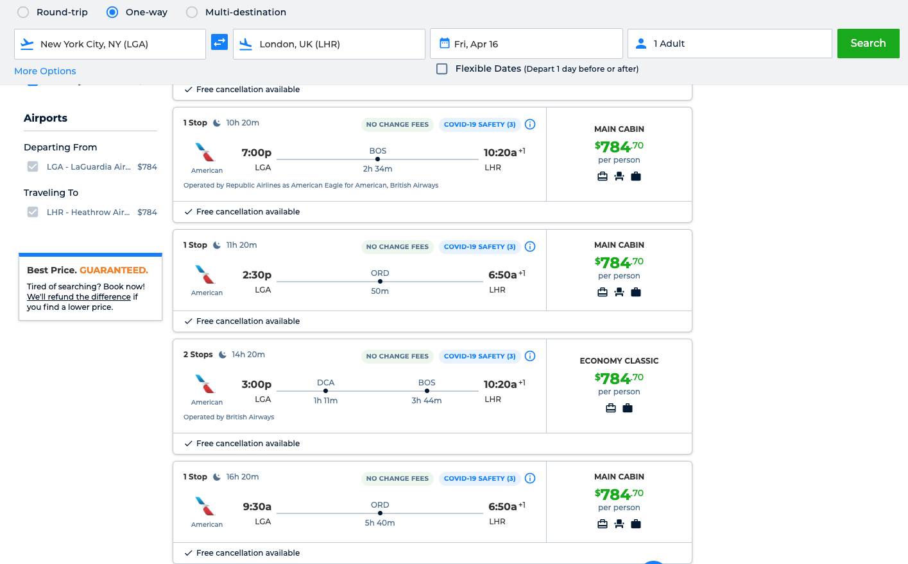
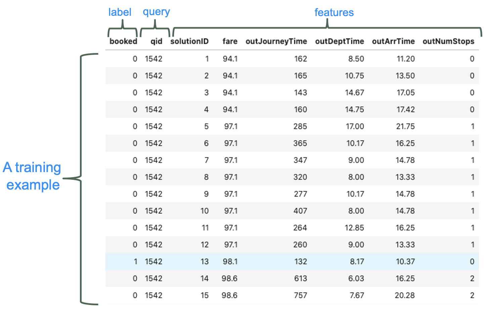
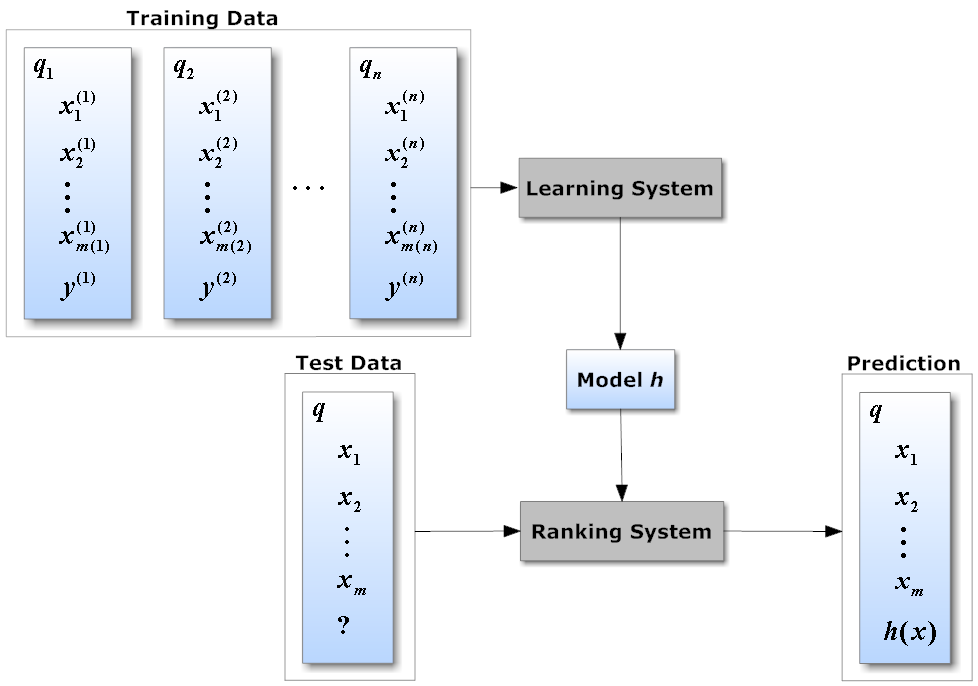
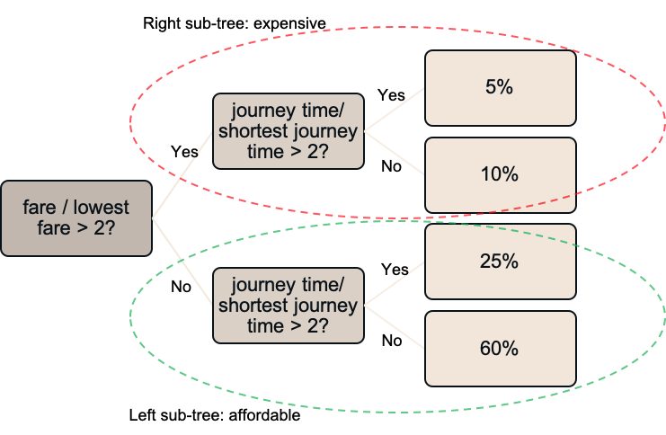
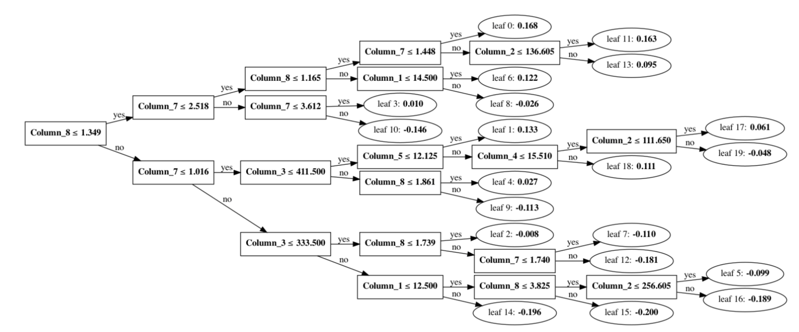
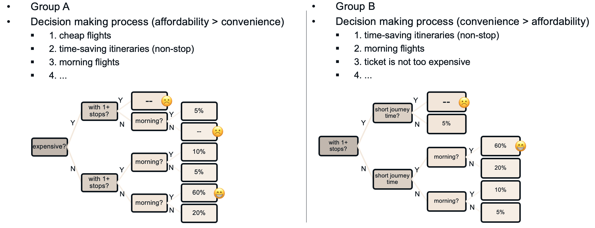
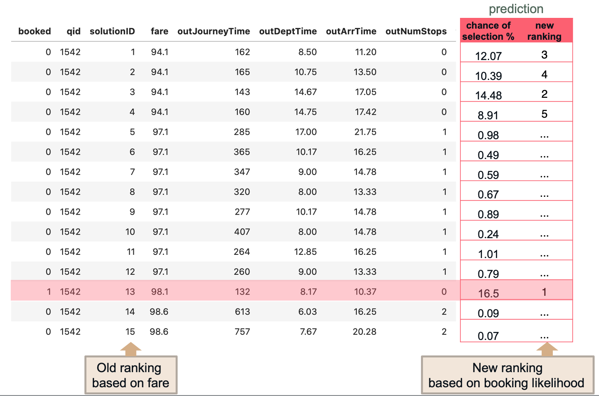

# Flight recommendation

## Pick the right flight

Millions of travelers around the world use online travel agent \(OTA\) like Priceline, Expedia and Kayak to book flights. When a customer shops a flight through OTA, it is not an easy decision-making process. There is information to be processed and problems to be considered. They want to find a match between what they need and what the airlines have to offer.

Factors like budget, connections, available times \(day of the week, time of the day\) usually play a big role on their decision making. It is a primary goal for a OTA like Priceline to provide _relevant and high quality flights options_ that best satisfy consumers' need. If consumers can't find what they need in a search, they may come back and search at another date, or they just walk away and try a new OTA.

## Conversion rate: look-to-book

For an OTA, it is crucial that people see relevant flight options. For a global distribution system \(GDS\) who serves OTAs, it is crucial that a good set of flight options are delivered to OTAs. An improvement in the candidate flights list could eventually improve the look-to-book conversion rate.

**High conversion rate** is a win for everybody: consumers spend less time and effort looking for a desired flight, an OTA satisfies and keeps their customers, and a GDS has less search/pricing engine infrastructure cost in a much smaller number of queries.

## Present the best flights

When a search/ query is made to the flight itinerary search system, hundreds of candidate itineraries options return. Each itinerary has different values for features like travel time, number of stops, cabin class, and probably most important for most traveler, the fare.

However, the goal of an OTA is not always to sell you the cheapest price, the goal is to improve conversion. If we assume people always prefer the affordable solutions, it makes sense to put the cheapest tickets at the top. But in reality, travelers take more factors into consideration.

For example:

* family trip with children, perhaps don't like an itinerary with 2 stops and short transition times 
* it makes sense to pay a little more one could save half of the travel time.

A cheap option may not be a preferred option. To improve conversion, it is desirable to rank the candidate itineraries by the probability of being picked.

## A recommendation system based on booking probability

Human 'experience' tells us that usually the decision process is about finding a balance between cost and convenience. This 'experience' is a mental model. The mental model inside our brain is trained by observing data. For a specific traveler, these data are the past flight booking experience, and the booking decision-making process made together with his friends and families \(See figure 1\). The data observed is limited, thus biased towards his own preference.

What if we have a database with booking& shopping data records from millions of travelers? Then we can take a look at these millions of data point, see what they chose from a list of candidate itineraries, then build a model. **This model tries to mimic the reasoning behind human's decision-making process.** The model is a computer algorithm learning 'experience' by observing big data.

## Combined data related to shopping & booking

A specific query for a shop \(with a unique query ID\) returns a list of candidate itineraries. One item of the list is booked \(relevance score label of 1 or 0 to represent booked or not\). We refer this pair of information as one query-documents data point. An example query-documents data point is shown as below. It is a table that contains a candidates-solution list and the corresponding labels.

In this query-documents data point, the candidate solution list has 15 itineraries \(documents\) presented, and a customer eventually picked \#13 from this list.

Obtaining millions of such query-documents data gives us a training set for building a model. When a new unseen candidate list is presented, this ranking system will predict the likelihood that each itinerary will be selected.

## Learning to Rank for Flight Itinerary Search

### What is Learning to rank?

Learning to rank \(LTR\) is a machine learning technique for training a model to solve a ranking task. Typically, it is a supervised/semi-supervised task. The training data consists of lists of items with relevance score assigned to each item. The relevance score qualifies how relevant an item is in response to the query. This score can be a numerical or binary \(relevant or not\). \[1\]

Given the training data, we try to learn a ranking model to predict the order of all items in an unseen list. The new permutation of the items in the list will give us more relevant results at the top of the list, and less relevant items at the bottom. To re-order the list, the model uses a newly calculated column: the probability that an item is chosen by a user. Higher probability score means a user will find this item more relevant to his query, thus more likely to be booked.

### How Learning to Rank differs from other ML problems?

_Learning to Rank_ \(LTR\) applies machine learning to search relevance ranking. How does relevance ranking differ from other machine learning problems?

In classic machine learning problems, with known information, we attempt to predict a variable that is dependent on the known information. The known information, such as square feet, number of bedrooms, year built, zip code etc., can help use predict the house price \(regression problem\), or to predict whether a house can be classified as expensive or not \(classification problem\). In these cases, we are looking for a mapping function f, that can take what’s known, and have f output a continuous or categorical variable.

In Learning to Rank, however, the mapping function f we want to learn does not make a direct prediction. Rather it’s used for ranking documents. We want a function that comes as close as possible to our user’s sense of the ideal ordering of documents dependent on a query. The value output by f itself has no direct meaning \(it’s not a housing price or a category\). It’s more a prediction of a users’ sense of the relative usefulness of a document given a query. \[2\]

## Problem setup

* For each query, we already have a list of flight itineraries \(items\) to choose from. The task is to predict a probability score to each item. 
* based on this probability score, we can obtain the top 3 'best' flights as our recommendation
  * assume we know nothing about the 'specific' customer
  * we collected lots of historical query-documents type look-to-book data. From these data we learn a ML model that resembles the reasoning of an 'average' customer

## Model implementation

The decision-tree algorithm is the choice of algorithm since it mimics how human make decisions. We ask a series of yes-or-no questions based on criteria of a certain feature. Subsequently we ask more questions and finally reached a decision.

To implement the tree-based learning algorithms to complete LTR task, we use the LightGBM library, which has LTR algorithms implementations, like LambdaMART we are going to use here. The details about how a LTR model is implemented with the lightGBM framework with code are explained in [**Part 2**](https://github.com/yzhu319/gitbook_blog/blob/main/Learn2Rank-flights.md).

To further illustrate the core idea behind the algorithm. We can look at an over-simplified example. A person may first ask "how expensive are the flights? are they twice as expensive as the lowest price?", if yes, one section of the results in the list will be considered as 'affordable', the other will be considered as 'expensive'. They will be on the left and right branch of the trees. The lower layer of the decision tree can further divide the left tree -- 'affordable' solutions. The next question may be "how long is the flight take? Do they take twice as long as the shortest flight?". These 2 splits then create 4 categories: affordable & short trip, affordable & long trip, expensive & short trip and expensive & long trip. If we stopped here as the leaf node, we will obtain 4 probability for the 4 types of itineraries.

For the illustration tiny decision-tree example, we only have 2 splits and use 2 features: normalized price and normalized journey time. For the real implementation, the tree structure can be very complex. For the tree split node, there are multiple features to choose from such as fare, journey time, number of stops, day of the week, departure time of the day, cabin class, etc. For each node, the split threshold is determined by the model training process. Furthermore, the boosting tree model will have a sequence of decision trees. The first tree structure of the model using the sample data is shown below. More technical details can be found in [**Part 2**](https://github.com/yzhu319/gitbook_blog/blob/main/Learn2Rank-flights.md).

When trained with different data, the model captures different thinking patterns for different groups of travelers. For example, for a cluster of consumers who prioritize affordability over convenience, they may first search for cheap flights, then time-saving flights. For a different group of travelers who are much less price-sensitive, they will probably have quite different decision-making processes.

## Recommended flights: model predictions

With the LTR model, for any unseen query-documents data, we can predict the probability of booking for each item in the candidate list. Then select the top 3 as 'highlighted best solutions' to recommend to a customer.

In the example, while the original list is sorted by price \(fare\), the model thinks solution \#13, \#3, and \#1 are the solutions with the highest likelihood of getting booked. And the booking data reveals that a customer picked \#13 solution.

We can see that the \#13 solution is ~4% more expensive than the lowest price, but it is a non-stop itinerary with the shortest journey time. It has a better quality than solution \#4-\#12. Thus a 'smart' ranking system with recommendation features should put this solution at the top of the list.

## Summary

We build a recommendation system that ‘thinks’ like a travel agent and recommend the 'best' relevant flights to a customer shopping for a ticket. This tool can help maximize conversion rate by selecting flights that improve consumer satisfaction.

One can think of the ML model building process as converting intelligence of human agents into a computer program. To train a virtual travel agent who can recommend the best flights, one need to teach the algorithm new knowledge. The knowledge is contained in the look-to-book data. Trained with new data, the model can gain ‘experience’ and ’knowledge’ over time, becoming a virtual flight picking advisor.

~~~~

\[1\] Mehryar Mohri, Afshin Rostamizadeh, Ameet Talwalkar \(2012\) Foundations of Machine Learning, The MIT Press ISBN 9780262018258.

\[2\] [https://elasticsearch-learning-to-rank.readthedocs.io/en/latest/core-concepts.html\#what-is-learning-to-rank](https://elasticsearch-learning-to-rank.readthedocs.io/en/latest/core-concepts.html#what-is-learning-to-rank)

