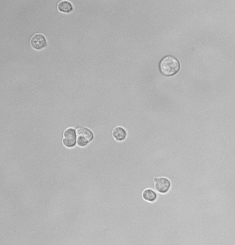
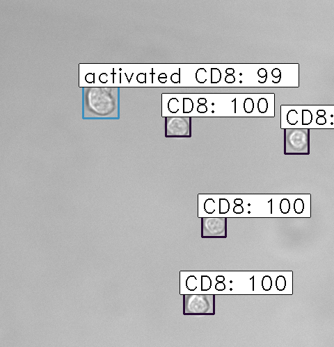

# Cell detection: faster-RCNN

## Objective

In this project, we want to train a model to automatically detect and classify different cells. 

The images captured under microscope contains a CD8, a T-cell receptor, and activated-CD8. These two cell types are shown in the following sample figure:

The corresponding annotation information for this figure is saved in a text \(or csv\) file. Each row represent a cell with 6 columns: 

1. **image\_path:** contains the path of the image
2. **xmin:** x-coordinate of the bottom left part of the cell
3. **xmax:** x-coordinate of the top right part of the cell
4. **ymin:** y-coordinate of the bottom left part of the cell
5. **ymax:** y-coordinate of the top right part of the cell
6. **cell\_type:** denotes the type of the cell

The sample annotation info is shown as the table below:

| image\_path | x\_min | x\_max | y\_min | y\_max | cell\_type |
| :--- | :--- | :--- | :--- | :--- | :--- |
| train\_images/Image\_sample | 113 | 1 | 150 | 27 | CD8 |
| train\_images/Image\_sample | 58 | 66 | 97 | 104 | CD8 |
| train\_images/Image\_sample | 324 | 111 | 370 | 158 | CD8 |
| train\_images/Image\_sample | 228 | 256 | 261 | 291 | CD8 |
| train\_images/Image\_sample | 312 | 359 | 352 | 397 | CD8 |
| train\_images/Image\_sample | 288 | 384 | 324 | 414 | CD8 |
| train\_images/Image\_sample | 124 | 258 | 156 | 303 | activated CD8 |
| train\_images/Image\_sample | 151 | 257 | 194 | 302 | activated CD8 |

With labeled training data, we aim to 1. detect the correct location of cells in a new image and 2. correctly classify two types of cells.

## Faster-RCNN for object detection

Object detection is a common task in computer vision. The algorithm we used here is Faster-RCNN. Faster-RCNN algorithm is optimized based on RCNN and Fast-RCNN, it replaces the selective search method with region proposal network \(RPN\) that makes the algorithm much faster.

## Implementation

The algorithm is realized with a Keras implementation of Faster R-CNN.



The details can be found in the README of this repo.

## Results

With GPU \(GeForce GTX 1660 Ti\), we train a model using the training data sets \(~160 images\). With each epoch, we record the following 4 metrics:

rpn\_cls, rpn\_regr, detector\_cls, detector\_regr

After about 50 epochs, the total error no longer decreases \(the total-loss VS epochs curve plateaus\) and we saved the model parameters to a model file. Those parameters are then used to make inferences. The two sample predictions are as follows. We can see the model can correctly detect all the cells in the image, and correctly classify these two cell types!

